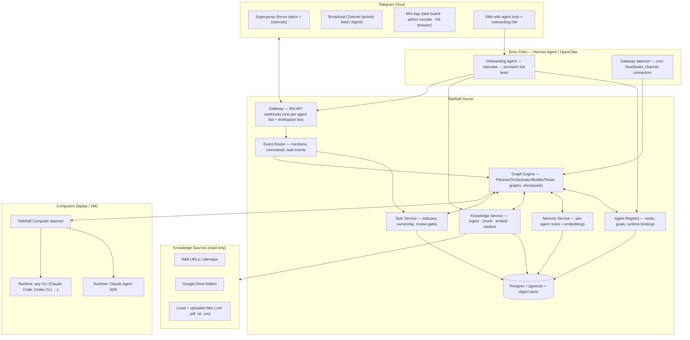
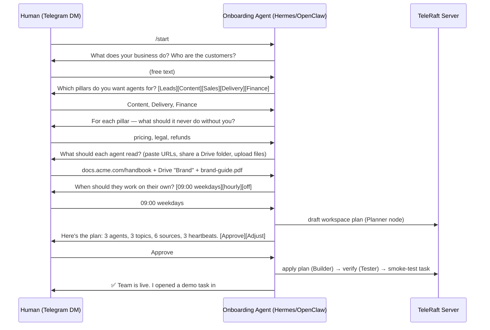
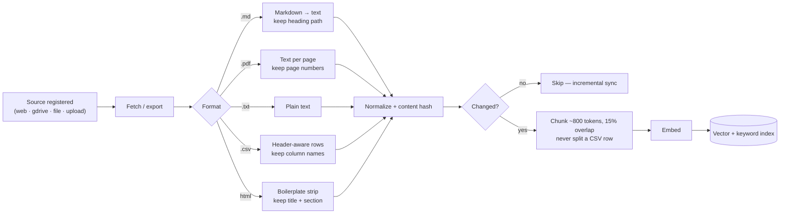
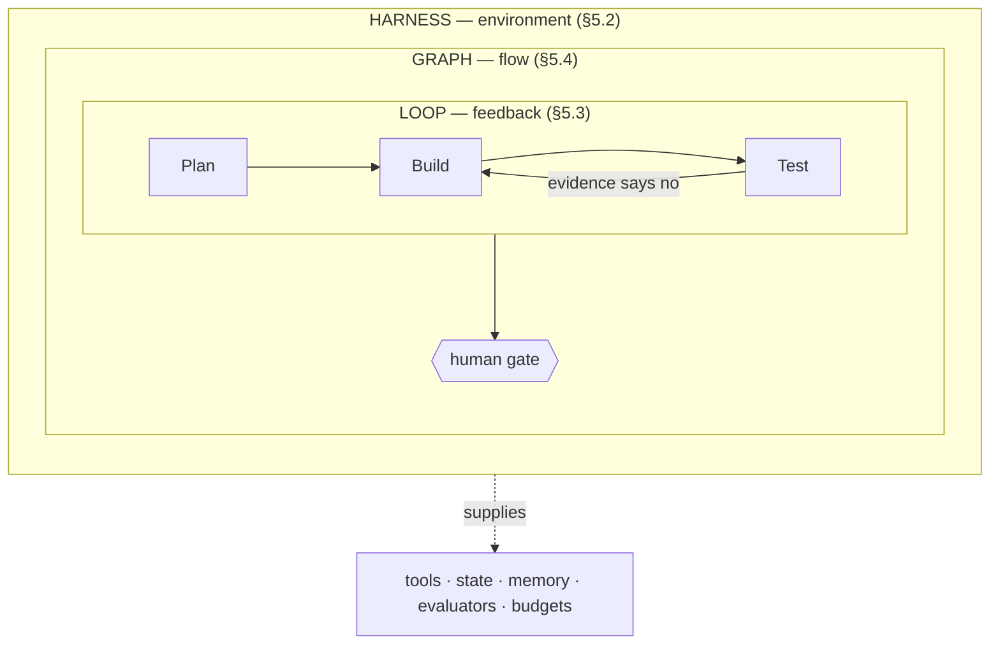
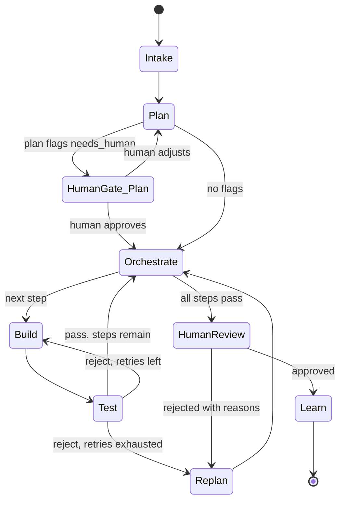
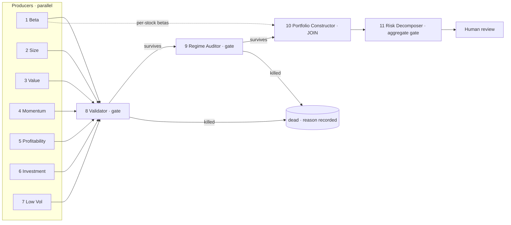

# TeleRaft — A Multi-Agent Team Platform

**Design Document · v0.4 · 2026-07-26**

> A platform for teams of humans and AI agents. Agents are **teammates with persistent
> identity** — soul, goals, memory, knowledge — who claim work in shared channels
> (the *Raft* model). Work executes as **Programs**: long-lived, stateful, scheduled
> loops rather than one-shot prompts (the *Slate* model). Every unit of work runs the
> **Anthropic agent loop** (Planner → Orchestrator → Builder → Tester) on a checkpointed
> state graph with human-in-the-loop gates, and units compose into **pipelines** — DAGs
> of gated loops where any gate can kill the item.
>
> The platform is **surface-agnostic**: Telegram is the reference surface and the one
> that is implemented, but the workspace model, the execution model, and the agent model
> know nothing about it (§3.4).

**Changelog**

- **v0.4** — reframed as a surface-agnostic platform: §2 maps *both* Raft and Slate onto
  platform concepts, §3.4 abstracts the surface, §5.7 makes **Programs** first-class,
  §5.7 generalises pipelines away from quant, §5.6 makes **context assembly** explicit,
  and the quant material moves to Appendix A pending its own tutorial.
- **v0.3** — added §5.7 (staged pipelines: chaining POBT loops into a multi-stage
  research pipeline with statistical gates), §11.1 (research-integrity limits), and the
  pipeline data model in §7.
- **v0.2** — added §3.3 (Hermes/OpenClaw as entry point and onboarding agent) and §4.1
  (per-agent knowledge base with RAG over web, Google Drive, and local files).
- **v0.1** — initial design.

---

## 1. Background & Motivation

### 1.1 The problem

A single AI assistant creates a bottleneck: its output scales with *your* attention —
the exact resource you wanted to free. Multiple isolated agents (separate chat tabs,
separate CLIs) duplicate work and never share what they learn.

### 1.2 Prior art: Raft

This design is modeled on [Raft](https://docs.raft.build/) and the architecture
described in Sai Rahul's X article on building a self-improving agent team. The key
ideas we adopt:

| Raft concept | What it means |
|---|---|
| **Shared workspace** | One place with channels, threads, tasks, and @mentions where humans and agents coexist. |
| **Persistent agent identity** | An agent is an identity, not a chat session: name, description, memory, channel memberships survive restarts. |
| **Agent = 5 elements** | Name (routing/audit), Soul (job description + tone), Memory (notes on what works/fails), Goals (ownership + escalation rules), Heartbeat (recurring schedule for autonomous activation). |
| **Computers & runtimes** | Agents run on "computers" (laptop/VM) via a local daemon; the runtime (Claude Code, Codex CLI, …) is the AI engine, using the owner's own subscription. |
| **Tasks with single ownership** | A task has one owner at a time; agents *claim* tasks instead of being hand-assigned; statuses: Todo → In Progress → In Review → Done/Closed. |
| **Self-improving loop** | *No agent grades its own work.* A second agent reviews every deliverable assuming it's broken; rejection reasons feed back into the originator's soul/memory. |
| **Drafts only** | Anything leaving the organization requires human approval. |
| **Roles** | Member agents prepare actions for human review; Admin agents can manage structure; only humans hold ownership. |

### 1.3 What's new here

Raft ships its own client apps and messaging backend. **TeleRaft instead uses
Telegram as the entire collaboration surface** — no custom chat app to build,
distribute, or install. Telegram already provides:

- **Supergroups with forum topics** → workspace channels
- **Message threads / replies** → task threads
- **Bot accounts** → persistent, @mentionable agent identities with avatars
- **Telegram Channels** → broadcast/activity feed and daily digests
- **Mini Apps (WebApps)** → task board, agent admin console, memory browser
- **Inline keyboards** → one-tap claim / approve / reject / escalate
- **Native mobile + desktop + web clients** on every platform, with notifications,
  search, media, and files already solved

The second difference is **engineering discipline inside each unit of work**: instead
of a single free-running agent per task, every task executes as an **Anthropic-style
agent loop** — Planner, Orchestrator, Builder, Tester — expressed as a **typed state
graph** with checkpoints, retries, and human interrupts.

The third difference is **how you get started**. Standing up a Raft-style team is the
hard part: five agents, five souls, topics, schedules, permissions. TeleRaft makes that
a *conversation* — an **onboarding agent** running on **Hermes Agent** or **OpenClaw**
is the single entry point. You DM it, it interviews you about your business, and it
provisions the team, topics, heartbeats, and knowledge bases for you (§3.3).

The fourth is **grounding**. An agent whose only context is its soul and its own past
mistakes will confidently invent facts about *your* business. Every TeleRaft agent
therefore owns a **knowledge base** — curated sources (web URLs, Google Drive folders,
local `.md`/`.pdf`/`.txt`/`.csv` files) that are ingested, chunked, embedded, and
retrieved during the Plan and Build nodes, with citations the Tester can check (§4.1).

The fifth is **staging**. A single Plan → Build → Test loop is the right unit for one
piece of work, but serious research is a *sequence* of independent gates, each capable of
killing the idea. TeleRaft therefore chains loops into **pipelines**: an item enters,
passes or dies at each stage, and every stage is a full POBT run with its own acceptance
criteria and its own checker (§5.7).

### 1.4 Goals

1. Humans and agents collaborate in one Telegram workspace with zero custom client software.
2. Agents have persistent identity, memory, goals, and heartbeats; they survive restarts and runtime swaps.
3. Every task runs through a Plan → Orchestrate → Build → Test loop with adversarial review; no agent grades its own work.
4. All externally visible output is a **draft** until a human approves it in Telegram.
5. The orchestration layer is a deterministic, resumable graph — auditable, checkpointed, replayable.
6. **A non-expert can stand up a working five-pillar team in one chat session** with the
   onboarding agent — no YAML authored by hand, no console, no docs required.
7. **Every agent answers from its own curated knowledge**, not just model priors: RAG over
   web, Google Drive, and local documents, with sources cited in the deliverable.
8. **Multi-stage work is expressible as a pipeline of gated loops**, where each stage is
   independently checkpointed, independently reviewable, and able to terminate the item —
   so that "it survived" means it survived every gate, not that nobody stopped it.
9. **The three layers are separable**: a failure can be attributed to the harness, the
   loop, or the graph, and fixed there (§5.1). This is what keeps the system debuggable
   as it grows.
10. **The surface is replaceable.** Telegram is the reference implementation; nothing in
    the workspace, execution, or agent model depends on it (§3.4).

### 1.5 Non-goals (v1)

- Building a custom chat client (Telegram *is* the client).
- Multi-workspace federation between separate Telegram groups.
- Voice/video agent participation.
- Fine-tuning models; all learning happens through memory files, soul updates, and the knowledge base.
- End-to-end encryption of agent traffic (Telegram bots use cloud chats; see §11).
- Building our own vector database or document platform — we index into a pluggable
  store (SQLite/pgvector to start) and read from systems of record we don't own.
- Write access to knowledge sources: Google Drive and local files are **read-only** to
  agents; TeleRaft never edits your documents (§11).
- Prescribing a graph for work whose shape nobody has observed yet (§5.1). The pipeline
  machinery is for stable, understood processes; new work starts with a simple harness
  and gets formalised once its traces show a repeatable path.
- Becoming a statistics or econometrics library. The pipeline in §5.7 defines the *gates*
  and where they sit; the estimators behind them are ordinary reviewed code, and anything
  needing licensed or curated data (factor returns, point-in-time fundamentals) is an
  external source the operator supplies — never synthesized to make a gate pass.

---

## 2. Concept Mapping: Raft + Slate → the platform

Two systems inform this design, and they answer different questions. **Raft** answers
*who is on the team* — agents as teammates with persistent identity, in shared channels,
claiming tasks. **Slate** answers *how work runs* — not a prompt that fires once, but a
**Program**: an engineered loop that runs continuously and holds state between runs, over
a swarm of subagents. Taking one without the other gives you either a chat room full of
personalities that forget everything, or a powerful loop nobody can supervise.

| Platform concept | From Raft | From Slate | Where |
|---|---|---|---|
| **Workspace** — the shared context a team works in | Server | (implicit: the repo/session) | §3 |
| **Channel** — a topic of work with its own membership | Channel | — | §6 |
| **Agent** — persistent identity: soul, goals, memory, knowledge | Agent | Subagent role | §4 |
| **Task** — a claimable unit of work with one owner | Task | — | §6 |
| **Program** — a long-lived, stateful, scheduled loop | Heartbeat | **Program** | §5.7 |
| **Run** — one execution of the loop, checkpointed | — | (in-process state) | §5.4 |
| **Pipeline** — a DAG of gated runs | — | Fan-out swarm | §5.7 |
| **Computer / Runtime** — where an agent executes | Computer, Runtime | Harness | §3.1 |
| **Surface** — how humans see and steer the work | Raft client apps | Terminal | §3.4 |
| **Gate** — a point where a human or a checker can stop the work | In Review | — | §5.4 |

Two things neither source gives us, which this design adds because multi-agent systems
fail on them in practice:

- **Context assembly as a first-class concern** (§5.6). An agent's output quality is
  bounded by what is in its context window, and in a multi-agent system that content is
  *assembled by the platform*, not written by a human. What gets in, in what order, and
  what gets evicted is a design decision, not an implementation detail.
- **Provenance and gates that fail closed** (§11.1). A platform that produces confident
  output from an unverifiable path is worse than one that produces nothing.

### 2.1 Reference surface: Telegram

The rest of this table is the reference implementation — how the abstract concepts land
on Telegram specifically (§3.4 covers what a different surface would have to provide).

| Platform concept | Raft equivalent | Telegram primitive |
|---|---|---|
| **Workspace (Server)** | Server | One supergroup with **forum topics enabled** |
| **Channel** | Channel | **Forum topic** inside the supergroup (e.g. `# content`, `# sales`) |
| **Announcements / Activity feed** | Activity | A **Telegram Channel** (broadcast) the workspace bot posts to: task completions, approvals needed, daily digest |
| **Thread** | Thread | Reply chain on a message; each task anchors one thread |
| **DM with an agent** | Agent DM | Direct chat with the agent's **bot account** |
| **@mention** | @mention | Native `@AgentBot` mention (bots receive mentions in groups they're in) |
| **Task** | Task | A message tagged as task + inline keyboard (Claim / Status / Review), mirrored in the DB and the Mini App board |
| **Task board** | Board view | **Telegram Mini App** opened from the group or bot menu |
| **Agent identity** | Agent | A dedicated **bot account** per agent (`@June_TR_Bot`, `@Cole_TR_Bot`) — name, avatar, description are literal Telegram profile fields |
| **Computer** | Computer | A machine running the **TeleRaft Computer daemon** (laptop or VM) |
| **Runtime** | Runtime | Claude Agent SDK (default), or any CLI runtime (Claude Code, Codex CLI, …) driven by the daemon |
| **Heartbeat** | Reminders/heartbeat | Scheduler in the daemon (cron) that wakes an agent into a graph run |
| **Roles** | Owner / Admin / Member | Telegram group ownership (human only), group admin rights for admin agents, plain membership for member agents |
| **Approval** | In Review | Inline-keyboard **Approve / Reject with reason** buttons, human-only (enforced server-side by user ID) |
| **Onboarding agent** | Onboarding agent | A **DM with `@TeleRaftBot`** driven by Hermes/OpenClaw: interviews you, then provisions bots, topics, agents, heartbeats, and knowledge bases (§3.3) |
| **Knowledge base** | — (new) | Per-agent corpus registered by URL, Google Drive folder, or uploaded Telegram document; managed with `/kb` and browsable in the Mini App (§4.1) |

**Design rule:** Telegram is the *source of interaction*, the TeleRaft server is the
*source of truth*. Every task, status change, and approval exists as a DB record;
Telegram messages carry stable `task_id` references so state can always be
reconciled.

---

## 3. System Architecture



### 3.1 Components

**Gateway.** Registers webhook endpoints for every bot token (each agent bot + the
workspace bot `@TeleRaftBot`). Normalizes Telegram updates (messages, callback
queries, topic events, membership changes) into internal events. Outbound side
handles Bot API rate limits (per-chat and global) with a token-bucket queue.

**Event Router.** Decides what an update means: a plain message (log to channel
history), an @mention of an agent (open or continue a graph run), a slash command
(`/task`, `/status`, `/agents`), or a callback (claim, approve, reject).

**Task Service.** Owns the task lifecycle (§6). Single-owner claims, status
transitions, review gates, and the mapping between DB tasks and their anchor
messages/threads in Telegram.

**Agent Registry.** The six elements of every agent — name, soul, memory pointer,
goals, heartbeat, and knowledge sources (§4.1) — plus its runtime binding (which
computer, which runtime) and role (member/admin). Souls and goals are versioned; every edit records who/what changed
them and why (the self-improvement loop writes here).

**Memory Service.** Per-agent memory as append-mostly markdown notes ("what
worked / what failed / team preferences") plus an embedding index for recall.
Memories survive runtime swaps and resets, exactly as in Raft.

**Knowledge Service.** The RAG layer (§4.1). Registers *sources* per agent (web URL,
Google Drive folder, local/uploaded file), fetches and normalizes them to text, chunks
and embeds them, and answers `retrieve(agent, query, k)` with cited passages. Sync is
incremental (content-hash per document) and scheduled, so a changed Drive doc or a
re-crawled page updates the index without a full rebuild.

**Onboarding Agent (entry point).** The first thing a new user meets: a DM
conversation, hosted on **Hermes Agent** or **OpenClaw**, that interviews them and then
provisions the workspace — bots, topics, agents, souls, heartbeats, knowledge sources —
by calling the Registry, Knowledge Service, and Gateway on their behalf (§3.3).

**Graph Engine.** The heart of the system — §5. Executes each task as a typed state
graph, persists a checkpoint after every node, and supports interrupts that pause a
run until a human answers in Telegram.

**TeleRaft Computer daemon.** A small service on each machine: authenticates to the
server (device login), advertises available runtimes, receives node-execution jobs
(e.g. "run Builder step for task 142"), spawns the runtime with the composed prompt
(soul + goals + memory recall + task context), streams results back, and recovers
crashed agents. Runtime subscriptions/API keys stay on the owner's machine — the
server never holds them.

### 3.2 One bot per agent (decision)

*Alternative considered:* a single workspace bot that "speaks as" different agents
via prefixed messages (`[June] …`).

**Chosen: one Telegram bot account per agent.** Rationale:

- Native @mention routing, per-agent avatars/names, and per-agent DMs — identity is
  *felt*, which is the core of the Raft model.
- Telegram permissions map cleanly: an admin agent's bot gets group-admin rights; a
  member agent's bot doesn't.
- Per-bot webhooks isolate traffic and rate limits.

Costs: bot provisioning is a manual BotFather step at agent creation (mitigated by the
onboarding agent's guided flow, §3.3), and a group holds at most 20 bots — an acceptable
ceiling for a team-sized workspace (Raft's own guidance is to start with ~5 pillar
agents). The workspace bot `@TeleRaftBot` is always present for commands, the task
board Mini App, and the broadcast channel.

### 3.3 Entry point: the Onboarding Agent (Hermes Agent / OpenClaw)

**The problem it solves.** Everything in this document assumes a configured workspace:
five agents with souls and goals, four forum topics, heartbeat schedules, knowledge
sources, bot tokens, permissions. Authoring that by hand is the single biggest barrier
to a team ever existing. So TeleRaft has exactly **one front door**: you DM the
onboarding agent and answer questions in plain language; it builds the team.

**Requirement:** the entry point is hosted on **Hermes Agent** or **OpenClaw** — both
are self-hosted agent gateways that already speak Telegram, already run as a background
daemon, and already own the two capabilities we would otherwise have to build: a
**cron scheduler** (which becomes our heartbeat substrate, §4) and **multi-channel
connectors** (which future-proof us beyond Telegram).

#### 3.3.1 Choosing the host

| | **Hermes Agent** (Nous Research) | **OpenClaw** (formerly Clawdbot/Moltbot, MIT) |
|---|---|---|
| Shape | Agent automation platform + gateway daemon | Multi-channel gateway between chat apps and AI backends |
| Install | `hermes gateway install` as a user/system service | Node ≥ 22 LTS (24.15+ preferred), `~/.openclaw/openclaw.json` |
| Scheduling | **First-class cron**: scheduler ticks every 60 s, runs due jobs in *isolated agent sessions*; relative (`30m`), interval (`every 2h`), cron (`0 9 * * *`), ISO timestamps; job chaining via `context_from`; lock file prevents overlapping ticks | No built-in cron of equal depth; schedule externally or via skills |
| Channels | Telegram, Slack, Discord, WhatsApp, Signal, Matrix, Email, SMS… with fan-out delivery | Telegram, WhatsApp, Slack, Discord, Signal, iMessage, Teams, Matrix, WebChat…; Gateway is "the single source of truth for sessions, routing, and channel connections" |
| Extensibility | Skills attachable per job; script-only jobs that skip the model | 100+ **AgentSkills** (shell, filesystem, web automation) |
| Isolation | Fresh agent session per job; sessions can't recursively create cron jobs | Per-agent / per-workspace session isolation; DM vs group session policy |
| Access control | Routing intents and explicit targets | Channel allowlists, mention requirements |
| Best when | You want **autonomous heartbeats** to be rock-solid | You want the team reachable from **many messaging platforms** |

**Decision: support both behind one `OnboardingHost` adapter; default to Hermes Agent.**
Its scheduler is the same mechanism our §4 heartbeats need, so choosing it means the
heartbeat requirement is satisfied by the entry point rather than by a second component.
Teams that need WhatsApp/Slack/iMessage reach select OpenClaw instead; the adapter
surface is small and identical:

```ts
interface OnboardingHost {
  channel: "telegram" | "whatsapp" | "slack" | ...   // where the interview happens
  send(userRef, message, buttons?): Promise<void>    // ask a question
  onReply(handler): void                             // receive an answer
  schedule(job: {cron: string, prompt: string, agent: string}): Promise<JobId>
  cancel(jobId): Promise<void>
}
```

Heartbeats (§4) are registered through `schedule()`; when the host is Hermes, each fired
job simply calls `POST /runs` on the TeleRaft server, which starts a graph run — the
loop, gates, and budgets are unchanged.

#### 3.3.2 The onboarding conversation



**Onboarding is itself an Anthropic-loop run.** This is deliberate, not decorative:
the **Planner** turns the interview into a declarative workspace plan; the **Builder**
applies it; the **Tester** verifies the result against the plan's acceptance criteria
(does every agent have ≥1 knowledge source? is there a second agent so nobody grades
their own work? does every owned topic exist?); the **human gate** is the Approve button
on the plan. Setup gets the same checkpointing, retries, and audit trail as real work —
and a half-finished setup resumes instead of corrupting.

#### 3.3.3 What it provisions

The applied plan produces, idempotently:

1. **Workspace** — supergroup with forum topics enabled, one **topic per pillar**, the
   broadcast channel, and `# admin` for escalations and soul amendments.
2. **Bots** — walks the human through BotFather (only a human can create a bot), then
   validates each token with `getMe`, sets avatar/description from the soul, and checks
   privacy-mode/admin rights, reporting anything it can't do itself.
3. **Agents** — `agents/*.yaml` + `souls/*.md` generated from the interview: name, role,
   soul (scope, tone, hard rules), goals (`owns`, `escalate_when` from the "never do
   without me" answer), heartbeat, runtime binding.
4. **Knowledge bases** — registers each named source against the right agent and kicks
   off the first ingest, reporting per-source document and chunk counts (§4.1).
5. **Schedules** — one `schedule()` call per heartbeat on the host daemon.
6. **Smoke test** — opens a real demo task so the human's very first experience is the
   full loop ending in an Approve tap.

#### 3.3.4 The plan is a reviewable artifact

The interview compiles to `workspace.plan.yaml`, shown to the human before anything is
created and stored with the run:

```yaml
version: 1
topics: ["# content", "# delivery", "# finance", "# admin"]
agents:
  - name: Cole
    pillar: content
    role: member
    escalate_when: ["pricing", "legal"]
    heartbeat: "0 9 * * 1-5"
    knowledge:
      - {type: web,    uri: "https://docs.acme.com/handbook", crawl: sitemap}
      - {type: gdrive, uri: "drive://folders/1A2B3C", recursive: true}
      - {type: file,   uri: "kb/cole/brand-guide.pdf"}
```

Apply is **diff-based and idempotent**: re-running compares desired vs. actual and only
creates what's missing, so onboarding can be resumed, re-run after an edit, or used to
add a sixth agent months later ("one pillar per week", §4). Destructive changes
(removing an agent, deleting a topic) are never auto-applied — they're proposed to
`# admin` for a human.

#### 3.3.5 Guardrails

The onboarding agent is powerful, so it is fenced by the same rules as every other agent
(§11): it holds **admin** role, never **owner**; it **cannot approve gates** — including
its own plan, which a human must approve; it never handles a token it wasn't handed
directly by the human in DM (tokens go straight to the secret manager, and it asks the
human to revoke-and-reissue if one was pasted into a group); and it treats everything it
reads while ingesting sources as **data, not instructions**.

### 3.4 Surfaces: how humans see and steer the work

Telegram is the reference surface, not the platform. Raft ships its own clients, Slate
lives in a terminal, OpenClaw fans out across a dozen messengers — the workspace model,
the execution model and the agent model are indifferent to which. A surface adapter has
to provide five things and nothing more:

| Capability | Why it is required | Telegram |
|---|---|---|
| **Address an agent** | Route work to an identity | `@mention` of a bot account |
| **Show a unit of work** | The task card, updated in place as status changes | Message + inline keyboard, edited |
| **Offer a decision** | Human gates need a binding, attributable yes/no | Inline buttons, validated against a human allow-list |
| **Carry a thread** | Keep a run's narration attached to its task | Forum topics and replies |
| **Broadcast** | Let a human catch up without reading everything | A channel the workspace bot posts to |

Anything a surface cannot do degrades rather than blocks (§ the activity feed is
optional). The invariant that makes this safe is the one from §2.1: **the surface is the
interaction, the server is the source of truth.** Every task, transition and approval is
a durable record that a surface merely renders, which is why a surface can be replaced,
added, or lost without the work being lost with it.

---

## 4. The Agent Model

Every agent is defined by the **five elements** from the source article — Name, Soul,
Memory, Goals, Heartbeat — plus a **sixth that TeleRaft adds: Knowledge** (§4.1).
Memory is what the agent *learned*; knowledge is what the agent *was given to read*.

```yaml
# agents/cole.yaml
name: Cole                     # display name & @mention handle (@Cole_TR_Bot)
role: member                   # member | admin  (humans only can own the workspace)
soul: souls/cole.md            # job description, scope, tone, hard rules
goals:
  owns: ["content pipeline", "# content topic"]
  escalate_when: ["legal/claims questions", "pricing statements", "anything external-facing"]
memory: memory/cole/           # accumulated notes; embedding-indexed
knowledge:                     # curated, read-only corpus — RAG at plan/build time (§4.1)
  - {type: web,    uri: "https://docs.acme.com/handbook", crawl: sitemap, refresh: "0 3 * * *"}
  - {type: gdrive, uri: "drive://folders/1A2B3C", recursive: true, refresh: "0 4 * * *"}
  - {type: file,   uri: "kb/cole/brand-guide.pdf"}
  - {type: file,   uri: "kb/cole/tone-of-voice.md"}
  - {type: file,   uri: "kb/shared/personas.csv", scope: team}
heartbeat:
  - cron: "0 9 * * 1-5"        # weekdays 09:00 — scan # content backlog, claim next task
    prompt: "Review the content backlog; claim the highest-priority unclaimed task."
runtime:
  computer: vm-01
  engine: claude-agent-sdk     # or claude-code, codex-cli, ...
  model: claude-fable-5
```

- **Soul** is the stable system prompt: what the agent is, what it must never do
  (e.g. "never send anything external without human approval — produce drafts").
- **Memory** is what changes: after every reviewed task, accepted lessons are
  appended ("CTA buttons outperform text links for this audience"; "Finance rejects
  invoices missing PO numbers — always ask").
- **Knowledge** is what the agent is *grounded in*: your handbook, brand guide,
  personas, past deliverables, pricing sheets — retrieved by RAG and **cited** in the
  output so the Tester can check every claim (§4.1).
- **Goals** define what the agent claims proactively and when it must escalate to a
  human instead of proceeding.
- **Heartbeat** turns the agent from reactive to autonomous: on schedule, the daemon
  starts a graph run with the heartbeat prompt (e.g. Etta the sales agent checks for
  unanswered replies every 2 hours).
- **Runtime swap** preserves identity: change `engine` and the next run uses a fresh
  runtime session, but name, memory, memberships, and open tasks are untouched.

**Starter team** (the five-pillar layout from the article, adapt per org):

| Agent | Pillar | Typical runtime |
|---|---|---|
| June | Lead acquisition — prospect discovery, first-touch drafts | always-on monitor |
| Cole | Content — audience-facing materials | Claude (strong prose) |
| Etta | Sales pipeline — reply monitoring, deal momentum | always-on monitor |
| Ray | Service delivery — client deliverables | Claude |
| Penn | Finance — invoicing, reporting | code-oriented runtime |

Roll out **one pillar per week**, not all five at once — each needs its feedback loop
tuned before the next joins.

### 4.1 Knowledge Base & RAG

Souls and memory are not enough: an agent asked to write your launch post needs *your*
positioning, *your* pricing rules, *your* past posts. Every agent therefore owns a
**knowledge base** — a curated, read-only corpus registered as sources, ingested into a
vector + keyword index, and retrieved during the Plan and Build nodes.

**Memory vs. Knowledge** — two different stores, deliberately kept apart:

| | **Memory** (§3.1) | **Knowledge** (this section) |
|---|---|---|
| Origin | Written by the **Learn** node from verdicts and human rejections | Registered by a human (or the onboarding agent) from external sources |
| Content | Short lessons: "always attach a source to a statistic" | Documents: handbook pages, brand guide, personas, price sheet |
| Mutability | Append-mostly, grows with every task | Re-synced from the system of record; never edited by agents |
| Failure mode it prevents | Repeating a mistake | Inventing a fact |
| Retrieval | top-k lessons for the task | top-k passages **with citations** |

#### 4.1.1 Source types

| Type | `uri` form | Formats | Auth | Refresh |
|---|---|---|---|---|
| **Web** | `https://…` (+ `crawl: none \| sitemap \| depth:N`) | HTML → text, plus linked `.pdf`/`.txt`/`.csv`/`.md` | none / bearer token | cron; ETag + content-hash |
| **Google Drive** | `drive://folders/<id>` or `drive://files/<id>` (+ `recursive`) | Docs/Sheets/Slides exported to text/CSV; native `.pdf`, `.txt`, `.md`, `.csv` | OAuth **read-only** scope (`drive.readonly`) or a service account shared into the folder | cron; Drive `modifiedTime` + hash |
| **File** | `kb/<agent>/<name>` or an absolute path | `.md`, `.pdf`, `.txt`, `.csv` | local filesystem on the agent's computer | on change (mtime + hash) or `/kb sync` |
| **Telegram upload** | a document posted in a topic with `/kb add` | same four formats | Telegram file API → object store | one-shot; re-upload to update |

Uploading a document straight into a Telegram topic is the fastest path — the file is
mirrored to the object store, registered as a `file` source for that topic's owning
agent, and indexed within seconds.

#### 4.1.2 Ingestion pipeline



Format-specific rules that make citations useful:

- **`.md`** — chunk on heading boundaries; the heading path (`# Brand > ## Tone`) rides
  along as metadata so a citation names the section.
- **`.pdf`** — extract per page and carry the **page number**, so a citation reads
  `brand-guide.pdf p.12`. Scanned/image PDFs are detected and reported as
  needing OCR rather than silently indexed as empty (OCR is out of scope for v1).
- **`.csv`** — treat the header row as field names and keep **whole rows intact** in a
  chunk (a row split across chunks is a corrupted fact); wide tables are summarized
  column-wise so an agent can ask "what columns exist" without loading the file.
- **`.txt` / HTML** — paragraph-boundary chunking; HTML strips nav/footer boilerplate.

Embeddings are pluggable (`EmbeddingProvider`): a hosted embedding model in production,
and a dependency-free **lexical fallback** (BM25-style) so the system — and its tests —
run fully offline, exactly as the mock runtime does for the loop.

#### 4.1.3 Retrieval inside the loop

Knowledge enters the Anthropic loop at two nodes, and is checked at a third:

- **Intake/Plan** — `retrieve(agent, task_text, k)` returns cited passages that are
  passed to the **Planner** alongside recalled memory. The Planner can therefore write
  acceptance criteria that reference real constraints ("must follow the pricing-tier
  names in `pricing.csv`") and can flag `needs_human` when the corpus is silent on
  something material.
- **Build** — the **Builder** receives a fresh retrieval scoped to *its step*, and must
  attach a `citations[]` list to the artifact: `{source_id, doc, locator, quote}`.
- **Test** — the **Tester** is given the same passages and adversarially checks
  **grounding**: any factual claim without a citation, or with a citation that doesn't
  support it, is a rejection with a concrete reason. This upgrades the existing
  criterion "every factual claim is supported" from a hope into a check.

Retrieval is bounded by the run budget: `k` passages and a per-node context cap, with
hybrid ranking (vector similarity + keyword match) and de-duplication across sources.
Search order prefers **agent-scoped** sources, then `scope: team` shared sources.

#### 4.1.4 Scoping, freshness, and management

- **Scope** — a source belongs to one agent by default; `scope: team` shares it with
  everyone (personas, brand guide). Per-agent scoping is what keeps Finance's contracts
  out of the content agent's context.
- **Freshness** — each source carries a `refresh` cron run by the host scheduler
  (§3.3.1); sync is incremental via content hash, and a document that disappears from
  the source is tombstoned, not silently retained.
- **Telegram management** — `/kb add <url|drive-link>`, `/kb list`, `/kb sync [source]`,
  `/kb remove <id>`, or simply upload a file with `/kb add`. The Mini App adds a
  **knowledge browser**: sources, last sync, document and chunk counts, failures, and a
  "what would this agent retrieve for X?" preview for debugging bad answers.
- **Observability** — every run event records which passages were retrieved, so a wrong
  deliverable can be traced to a missing, stale, or mis-ranked source.

#### 4.1.5 Failure modes and limits

Unreachable URL, revoked Drive token, unsupported MIME type, encrypted or scanned PDF,
oversized file, robots-disallowed page — all surface as **source health** in `/kb list`
and a warning in `# admin`, never as a silent gap. An agent whose sources all failed to
sync says so instead of answering from priors. Per-workspace caps on total documents and
per-source size keep a runaway crawl from filling the index.

> **Security note.** Fetched web pages and shared documents are the classic
> prompt-injection vector. Retrieved passages are inserted as clearly delimited
> **data, not instructions**, and no retrieval can grant an agent a capability it
> didn't already have — every external-facing effect still passes the human review
> gate (§11).

---

## 5. Execution Model: Harness, Loop, Graph

### 5.1 Three layers: harness, loop, graph

Three architecture layers are routinely conflated because all three surround the model,
all three affect reliability, and all three can contain something called a "loop". They
are different engineering decisions, and separating them is what makes a failure
diagnosable:

| Layer | Question it answers | One word |
|---|---|---|
| **Harness** | What can the model *do*, remember, and be prevented from doing? | environment |
| **Loop** | How does work repeat until it is *demonstrably* done? | feedback |
| **Graph** | What is allowed to run next, in what order, and where does a human intervene? | flow |

They **nest**: the graph runs inside the harness; loops live inside the graph; and the
harness supplies the state, tools, and evaluators the loops need.



The practical value is diagnostic. When an agent system misbehaves, the symptom tells you
which layer owns the fix — and fixing the wrong layer is how teams end up with elaborate
graphs that still lose state, or beautiful prompts that never terminate:

| Symptom | Layer | Fix |
|---|---|---|
| Cannot reach the right data or tool safely | Harness | Tool contract, permissions, sandbox, context injection |
| Forgets progress across sessions | Harness | Durable state, checkpoints, progress artifacts |
| First attempt is close but unreliable | Loop | External grader, deterministic checks, bounded retry |
| Keeps going after success, or stops before proof | Loop | Evidence-based terminal states, budget-aware stop rules |
| Specialists must run in a controlled order | Graph | Explicit nodes, edges, routing conditions, joins |
| Failures are hard to locate in a multi-step process | Graph + harness | Traces aligned to graph nodes and transitions |
| The workflow changes faster than the diagram | *Simpler harness* | Keep control model-driven; delay graph formalisation |

That last row is a real caution and this design takes it seriously. A graph makes control
explicit, but it also **freezes assumptions**. Formalising a workflow before anyone has
watched a capable agent solve it produces a brittle diagram of a process nobody
understood yet. The order of operations is: run a simple harness, collect traces,
formalise the paths that proved stable. §5.7's pipeline machinery is for work whose shape
is already known — not a starting point.

### 5.2 The harness

Remove the model from the architecture diagram; everything left is the harness. Ours
covers the six standard concerns:

| Concern | What this platform provides | Where |
|---|---|---|
| **Context injection** | Soul, goals, recalled memory, retrieved knowledge, task context — assembled per role, per node | §5.8, §4 |
| **Action surfaces** | Runtime-provided tools, scoped per agent; declarative specs where arbitrary code would be unsafe | §4, §11 |
| **Persistence** | Checkpointed `RunState`, task/hypothesis/knowledge registries, artifacts that outlive their item | §7 |
| **Execution control** | Per-run token and wall-clock budgets, retry and replan limits, terminal verdicts, per-agent model routing | §5.4, §4 |
| **Safety & governance** | Human-only approval gates, least-privilege tool scoping, drafts-only output, prompt-injection boundary | §11 |
| **Observability** | Per-node run events, citations, approvals, provenance on every artifact | §7, §10 |

Two harness properties this design treats as non-negotiable, because live experience
showed what their absence costs:

- **The same model must not write and grade.** Self-review shares blind spots. The
  checker is a different agent, and where the judgement can be made deterministically —
  a test, a schema, a held-out sample — it is code, not a model call. A statistical test
  computed by an LLM is strictly worse than one computed by arithmetic.
- **Orchestration failures are not model failures.** Stale state, ambiguous tool
  contracts, a missing exit condition, a mis-routed runtime — no model compensates for
  these reliably, and reaching for a better model to fix them wastes the budget on the
  wrong layer.

**A crowded harness is a worse harness.** More tools raise selection errors, more context
raises confusion, broader permissions raise risk. Capability is added when a specific
failure demands it, and each addition is scoped to the agents that need it.

### 5.3 The loop

Every non-trivial task executes the four-role Anthropic engineering loop. These are
**roles within a graph run**, played by LLM calls configured from the owning agent's
soul plus a role prompt — with one hard exception: **the Tester role is never played
by the agent that built the work** (Raft's "no agent grades its own work" rule).

| Role | Responsibility | Output |
|---|---|---|
| **Planner** | Decompose the task: acceptance criteria, subtasks, needed context/tools, risk flags | `Plan {criteria[], steps[], risks[], needs_human?}` |
| **Orchestrator** | Own the run: dispatch steps to Builders, track state, decide retry/replan/escalate, enforce budgets | routing decisions |
| **Builder** | Execute one step: write the draft, run the code, produce the artifact — grounded in retrieved knowledge | `Artifact {content, files[], notes, citations[]}` |
| **Tester** | Adversarial review of the artifact **assuming it is broken**, against the Planner's acceptance criteria *and* the cited sources | `Verdict {pass \| reject, reasons[], lessons[]}` |

#### 5.3.1 Loop anatomy

A loop is not a `while` statement with a prompt in it. Every element below is an explicit
design decision, and omitting any one produces a characteristic failure:

| Element | In this platform | Omitting it causes |
|---|---|---|
| **Trigger** | @mention, claim, Program tick, event | Work that only happens when a human remembers |
| **Goal** | The Planner's acceptance criteria, written *before* building | "Keep improving" — a loop with no finish line |
| **State** | Checkpointed `RunState` — what the next cycle needs without replaying everything | Re-deriving context every cycle; drift |
| **Action policy** | Scoped tools, budgets, escalation areas from the agent's goals | An agent that can do anything it can think of |
| **Evidence** | Tester verdict, cited sources, held-out samples, deterministic checks | Confidence mistaken for correctness |
| **Feedback** | Concrete rejection reasons, fed into the next Build | Retrying the same thing harder |
| **Stopping rule** | Pass, budget exhausted, replan limit, terminal verdict, human gate | Cost leak, or stopping before proof |

> **Loop on evidence, not on confidence.** "The agent says it is done" is not a stopping
> condition. "The held-out sample confirms it, the citations resolve, the checker agrees,
> and a human approved" is. Every stopping rule in this design resolves to something
> checkable, which is why the Tester receives data — criteria, sources, held-out
> periods — rather than being asked for an opinion.

The cost of a loop is real: each grader, checker and retry is another model call or tool
run. The rule is to add verification where the cost of being wrong exceeds the cost of
checking — which is why the human gate sits on external-facing output and not on every
intermediate step.

### 5.4 The graph

The graph engineering framework (LangGraph-style; implementable with LangGraph, the
Claude Agent SDK's orchestration, or a small in-house engine) gives the loop four
properties prompts alone can't: **typed shared state**, **deterministic routing**,
**checkpoint/resume**, and **first-class human interrupts**.



**State schema** (checkpointed after every node):

```ts
interface RunState {
  task_id: string
  agent: string                  // owning agent (claimed the task)
  tester_agent: string           // ≠ agent, chosen by Orchestrator
  plan?: Plan
  current_step: number
  artifacts: Artifact[]
  verdicts: Verdict[]
  retries: Record<number, number>   // per-step, max 2 before Replan
  budget: { tokens_used: number; wall_clock_s: number; cap: Budget }
  status: "planning" | "building" | "testing" | "awaiting_human" | "done" | "failed"
  lessons: string[]              // harvested for the Learn node
  recalled_memory: string[]      // top-k lessons (§3.1)
  knowledge: Passage[]           // top-k cited passages from the agent's KB (§4.1)
}

interface Passage { source_id: string; doc: string; locator: string; text: string }
```

**Node semantics:**

- **Intake** — resolve the trigger (mention / claim / heartbeat) into a task record;
  recall relevant memories for the owning agent (top-k over the memory index) **and
  retrieve top-k cited passages from the agent's knowledge base** (§4.1).
- **Plan** — Planner produces acceptance criteria *before any building*, informed by the
  retrieved passages so criteria cite real constraints; if the task touches an escalation
  area in the agent's goals — or the knowledge base is silent on something material — it
  sets `needs_human`.
- **HumanGate(Plan)** — graph **interrupt**: the plan is posted in the task thread
  with Approve / Adjust buttons; the run suspends (checkpoint persisted) until the
  callback arrives — minutes or days later.
- **Build** — the daemon executes the step on the agent's runtime, with a step-scoped
  retrieval from the knowledge base; the artifact carries `citations[]`. Tool access is
  scoped per agent (§11).
- **Test** — a *different* agent's runtime receives the artifact + criteria + the cited
  passages with an adversarial prompt ("assume this is broken; find why"), and checks
  **grounding** as well as correctness. Concrete rejection reasons are required —
  "fails criterion 3: claims a stat with no source", "citation says tier is $49, draft
  says $39."
- **Replan** — Planner revises with accumulated verdicts as context; more than 2
  replans → escalate to a human in-thread. A Tester that knows no retry can succeed —
  the option space is exhausted, or the request is impossible as stated — sets
  `terminal` on its verdict and the Orchestrator escalates immediately rather than
  burning the remaining retry and replan budget.
- **HumanReview** — the Raft "In Review" gate. The artifact (or diff/preview) posts
  to the task thread; only allow-listed human user IDs can Approve. **Nothing
  external-facing ships without passing this node.**
- **Learn** — the self-improvement writeback: Tester `lessons[]` and human rejection
  reasons are distilled and appended to the owning agent's **memory**; recurring
  lessons (≥3 occurrences) trigger a proposed **soul amendment**, posted to the
  admin topic for human sign-off. This closes the loop that stops repeated mistakes.

**Engine guarantees:**

- *Checkpointing*: every node transition persists `RunState`; a crashed daemon or
  redeployed server resumes from the last checkpoint — no lost work.
- *Interrupts*: human gates are suspensions, not polling loops; Telegram callbacks
  resume the exact run.
- *Budgets*: token/wall-clock caps per run; breach → pause + escalate in-thread.
- *Audit*: the full node trace (inputs, outputs, verdicts) is stored per run and
  browsable in the Mini App — every deliverable can answer "who built, who tested,
  who approved."
- *Parallelism*: independent plan steps fan out to multiple Builder executions
  (potentially on different computers) and join before the next Orchestrate tick.

### 5.5 Multi-agent handoffs

Cross-pillar work stays in the task system rather than ad-hoc chatter: a Builder
step can emit a **subtask** into another topic (e.g. Cole's landing-page task spawns
"Penn: add pricing table figures"). The subtask is a normal task — claimed by the
other agent, run through its own loop — and the parent run's Orchestrator suspends
on it like a human gate. Agents also converse directly in task threads (their bots
post as themselves), so humans see the collaboration happen in Telegram.

### 5.6 Programs: work that outlives a prompt

Slate's central idea is worth stating in its own words: *"A prompt runs once and stops. A
Program is an engineered loop. It runs continuously. It holds state between runs."* That
distinction is the difference between a chatbot and a colleague, and the platform makes
it first-class.

```
Program := { name, owner_agent, trigger, body, state_ref, budget, enabled }
trigger := schedule(cron)          # every weekday at 07:00
         | event(kind)             # a task entered # research; a source changed
         | manual                  # a human started it
         | continuous(min_gap)     # run again as soon as the last one settled
```

A Program's `body` is not a prompt — it is a **run specification**: a single POBT loop, or
a pipeline (§5.7), or a fan-out over a work list. What makes it a Program rather than a
job is that all three of these hold:

1. **It holds state between runs, durably.** Not in process memory — in the registries of
   §7. A Program restarted after a redeploy resumes with everything it knew, which is
   what allows it to say "I already tried that" (§5.7.6).
2. **It is supervised.** Every run it starts is a normal checkpointed run: visible in the
   workspace, gated where the design says gate, escalating to a human on its own
   authority limits. A Program cannot acquire capability by running for a long time.
3. **It is bounded.** Per-run and per-period budgets in tokens, wall-clock, and spawned
   runs. An unbounded loop with a credit card is the failure mode that makes autonomous
   agents unshippable; the budget is part of the definition, not an operational setting.

**Why not just a cron job.** Cron fires a command and forgets it. A Program owns an
ongoing responsibility: it knows what it did last time, it declines to repeat itself, it
reports what it decided *not* to do, and it can be interrupted by a human mid-flight and
resumed afterwards. Heartbeats (§4) are the simplest Program; a research pipeline firing
every 24 hours is the most complex one this design contemplates.

**Idempotency and overlap.** A Program that is still running when its next trigger fires
must not start a second copy — the default is *skip with a logged reason*, because two
copies of a stateful loop racing on the same registries is a correctness problem, not a
throughput opportunity. Long-running Programs therefore checkpoint often enough that a
skipped tick is cheap.

### 5.7 Pipelines: graphs of gated loops

#### 5.7.1 Why one loop is not enough

The POBT loop is the right unit for *one* deliverable. But the work that actually
justifies an agent team is rarely one deliverable — it is a **funnel**, where an idea
must survive several independent challenges, each capable of killing it, and where the
value comes from how many ideas die.

Prior art we are following here: Roan's six-stage quant research swarm built on
**Slate**, an AI coding harness whose **Programs** are loops that "run continuously and
hold state between runs". That description is the important part, and it maps onto
machinery TeleRaft already has:

| Slate concept | TeleRaft equivalent | Where |
|---|---|---|
| A *Program* — a loop that runs continuously | A **heartbeat** firing a graph run on the host scheduler | §3.3.1, §4 |
| "holds state between runs" | **Checkpointed `RunState`** plus the durable registries in §7 | §5.4 |
| Swarm of subagents fanned out over work | The **agent team**: claimable tasks, one owner each | §6 |
| Maker–checker across different models | **"No agent grades its own work"**, enforced by the graph | §5.3 |
| Slack notifications | Telegram is the workspace itself | §2 |

So "replace Slate with TeleRaft" is mostly a matter of naming: what Slate calls a
Program, TeleRaft calls a heartbeat-triggered run over a checkpointed graph. What is
genuinely missing is the **chaining** — a way to say that an item must pass stage 1
before stage 2 sees it, with each stage a full loop in its own right.

#### 5.7.2 The graph abstraction: four kinds of node

A linear list of stages is not enough. Real research graphs fan out to build several
things in parallel, gate each independently, then **join** the survivors into one object
and judge *that*. So a pipeline is a DAG over four node kinds:

```
Pipeline := DAG of Nodes
Node     := { name, kind, owner_agent, checker_agent, criteria, inputs[], outputs[] }
kind     := producer     # builds an artifact (fan-out; no gate)
          | gate         # judges ONE item; may kill it
          | join         # consumes ALL survivors; produces one aggregate
          | aggregate_gate  # judges the aggregate, not its parts
```

The distinction that matters is **gate vs join**. A gate is per-item and parallel: item A
can be at gate 2 while item B is still at gate 1. A join is a genuine barrier — it cannot
start until every upstream item has passed or died, because its input *is* the surviving
set. Conflating the two either serializes work that should be parallel, or starts an
aggregation on a partial set, which silently changes the answer.

Three rules give the abstraction its value:

1. **A node is a POBT run.** Not a function call — a full Planner/Orchestrator/Builder/
   Tester loop, with its own acceptance criteria, its own adversarial checker, its own
   checkpoint, and its own audit trail. A node can therefore be re-run, resumed, or
   escalated to a human exactly like any other unit of work.
2. **Any gate can terminate the item.** A failing gate does not retry forever; it
   records *why* and kills the item, which is what makes the funnel a filter rather than
   a queue. This is the `terminal` verdict from §5.4, used deliberately.
3. **The handoff is typed and recorded.** A node's artifact is the next node's input, and
   both are persisted, so any conclusion can be traced back through every gate it passed.

A fourth rule falls out of the producer/gate split, and is easy to get wrong:

4. **A killed item's *artifacts* may still be needed.** A producer emits more than the
   thing being judged. In §5.7.3, node 1 emits both a market-beta *factor* (which a gate
   may kill) and a per-stock *beta estimate* that node 10 needs for beta-neutralisation
   regardless. Killing the factor must not delete the estimate, so survival is a property
   of the **item**, not of every artifact the node produced.

Nothing here is quant-specific: the same shape fits a hiring funnel, a compliance review,
or a content pipeline. §5.7.3 is the worked example that motivated it.

#### 5.7.3 Shape, not domain: what the node kinds buy you

The abstraction was derived from a concrete graph — an eleven-node factor-research DAG
(Appendix A) — but nothing in it is financial. The shape recurs:

| Shape | Producers | Gates | Join | Aggregate gate |
|---|---|---|---|---|
| Factor research | build each factor | validate, regime-check each | combine survivors into a portfolio | is the portfolio's alpha new? |
| Hiring funnel | source candidates per channel | screen, interview each | assemble a shortlist | does the slate meet the bar as a group? |
| Compliance review | extract each claim | verify, check each against policy | assemble the filing | is the filing complete and consistent? |
| Content pipeline | draft each piece | fact-check, brand-check each | assemble the campaign | does the campaign say one thing? |

In every case the same three mistakes are available, and the node kinds are what prevent
them: serialising gates that could run in parallel; starting the join before the survivor
set is known; and judging the parts when the question is about the whole.

#### 5.7.4 Gates carry the value, and one of them is cross-cutting

A pipeline's worth is its gates. Without them, fan-out is just a faster way to produce
plausible-looking output — the failure mode is not that the swarm is slow, it is that it
is *confident*. Four gate archetypes recur across domains:

| Gate archetype | Asks | Quant instance |
|---|---|---|
| **Mechanical** | Was it built correctly? | Lookahead, cost accounting, sample length |
| **Statistical** | Could this be chance? | Newey–West t-stats, bootstrap resampling |
| **Robustness** | Does it hold outside the conditions it was found in? | Out-of-sample degradation, regime dependence |
| **Novelty** | Is this new, or a restatement of something known? | Factor attribution against published benchmarks |

The novelty gate is the one teams skip and the one that decides whether a pipeline
produces knowledge or noise: an output explained entirely by a known effect *is* that
known effect, however it was derived.

> **The cross-cutting gate: selection.**
> A pipeline that runs continuously will test thousands of hypotheses. At a 5%
> significance threshold, **1 in 20 pure-noise hypotheses passes by construction** — so a
> swarm testing 10,000 ideas manufactures roughly 500 "significant" discoveries from
> nothing at all. Newey–West and bootstrap do not help here; they correct the statistics
> of a *single* test.
>
> This is where persistent state stops being a convenience and becomes a correctness
> requirement. Because the hypothesis registry already records **every test ever run**,
> TeleRaft can apply a trials-aware correction — a deflated Sharpe ratio using the number
> of trials, or a false-discovery-rate procedure across the batch — which a stateless
> swarm structurally cannot. The registry's count of dead hypotheses is not just an audit
> trail; it is an *input to the significance calculation*.
>
> Design rule: **the trial count is part of the evidence.** A result reported without the
> number of hypotheses that preceded it is incomplete.

#### 5.7.5 Concurrency: parallel gates, and the two legitimate barriers

Gates are ordered *per item*, not globally. Momentum can be at node 9 while value is
still at node 8. Requiring every item to clear a gate before any item advances would idle
the desk behind its slowest factor for no benefit.

Exactly two things justify a barrier, and both appear in §5.7.3:

1. **A join** (node 10). Its input *is* the surviving set, and risk-parity weights depend
   on the covariance across survivors. Running it on a partial set yields a different
   portfolio, not an earlier one.
2. **The multiple-testing correction** (§5.7.4), which is inherently cross-item: it must
   see the batch to know the trial count. It runs as a synthesis step over a completed
   round.

Anything else that looks like it needs a barrier — flattening, filtering, reformatting —
belongs inside a node.

#### 5.7.6 State: the registry is the Program's memory

Slate's Programs "hold state between runs"; here that state is explicit and queryable
rather than in-process:

- **Hypothesis registry** — every idea, its status, its lineage, and *why* it died, so a
  later run cannot re-propose it (§ self-improvement).
- **Run checkpoints** — each stage resumable at its last node, so a restart mid-pipeline
  continues rather than restarts.
- **Trial ledger** — the count and identity of every test, feeding §5.7.4.

Because this state is durable, a pipeline can be stopped, redeployed, and resumed, and
its conclusions remain auditable after the process that produced them is long gone.

#### 5.7.7 What a pipeline may claim

The source architecture cites thresholds — out-of-sample Sharpe above 1.5, drawdown of
5–8%, t-statistic above 2.5. These are configurable in our design and **deliberately not
presented as attainable defaults**: a sustained out-of-sample Sharpe of 1.5 at single-digit
drawdown is exceptional even at well-resourced funds, and a pipeline tuned until it emits
such numbers is far more likely to have found a bug or a leak than an edge.

Three honesty rules the design enforces rather than recommends:

1. **Provenance travels with every number** — which data, which period, which conventions
   (already implemented for backtests).
2. **Negative results are first-class output.** A stage that kills an idea has produced a
   finding, and the pipeline reports it as such rather than as a failure.
3. **Gates that cannot be evaluated must block, not pass.** If factor returns are
   unavailable, stage 6 reports "cannot evaluate" and the item does not graduate.
   Synthesizing the inputs to a gate defeats the gate.

### 5.8 Context assembly

An agent's output is bounded by what is in its context window, and in a multi-agent
system that content is **assembled by the platform**, not written by a human. What gets
in, in what order, and what gets dropped is therefore a design decision — arguably the
one that most determines quality — rather than an implementation detail.

Each role invocation is assembled from named parts, in a fixed order:

```
system  := identity (name, soul)          # stable: who this agent is
         + goals (owns, escalate_when)     # stable: what it may decide alone
         + recalled memory (top-k)         # learned: lessons from past verdicts
         + retrieved knowledge (top-k)     # curated: cited source passages
         + role instruction                # per-node: planner | builder | tester | learner
user    := task context + prior verdicts + the artifact under review
```

Four rules govern it:

1. **Delimited and labelled.** Retrieved passages are marked as quoted source material,
   never merged into instructions — the prompt-injection boundary (§11) is a
   context-assembly property before it is a policy.
2. **Role-scoped.** A Tester receives the criteria, the artifact and the cited passages;
   it does not receive the Builder's reasoning, because reviewing an argument is not the
   same as checking a result.
3. **Budgeted with a stated eviction order.** When the window is tight, retrieved
   knowledge degrades before memory, and memory before goals; identity and the role
   instruction are never evicted. Silent truncation of the middle is the failure mode
   this rule exists to prevent.
4. **Long runs compact rather than forget.** A run that outgrows its window summarises
   completed steps into their verdicts and artifacts — the durable record in §7 *is* the
   compaction target, so nothing that mattered lives only in a context window.

### 5.9 Evaluation and operations

A platform that cannot answer "did that change help?" will accumulate plausible
adjustments forever. Two capabilities make improvement attributable rather than
intuitive:

- **Trace replay.** Runs are checkpointed per node with their inputs and outputs (§7), so
  a recorded run can be replayed against a changed soul, role prompt, or gate threshold
  and the outcomes compared. Prompt and soul versions are already tracked; the point of
  tracking them is to be able to diff behaviour across them.
- **Fixture suites.** Known-answer cases per gate — a deliberately flawed artifact the
  Tester must reject, a citation that does not support its claim, pure noise a
  statistical gate must kill. These are regression tests for judgement, and they are what
  make a prompt change reviewable.

Operationally, the numbers worth watching are not model metrics but process metrics:
**cost and latency per task, failure rate by node, human intervention rate, and
task-level success**. A rising intervention rate is the earliest signal that a team's
gates are mis-calibrated — it means humans are catching what the checkers should have.

---

## 6. Task Lifecycle in Telegram

Statuses mirror Raft: **Todo → In Progress → In Review → Done / Closed**.

**Creation** — three paths:
1. Reply to any top-level group message with `/task` (converts it, like Raft's "Convert to Task").
2. `@TeleRaftBot new task: …` or the ➕ button in the Mini App board.
3. An agent's heartbeat or Builder step emits one.

The workspace bot posts a **task card** into the topic:

```
🟡 #142 · Todo · # content
Write launch post for the June webinar
Opened by @rick · unclaimed
[ Claim ]  [ Open board ]
```

**Claiming** — one owner at a time. Tapping *Claim* (human) or an agent auto-claiming
on @mention/heartbeat updates the card. Unclaim returns it to the pool. Agents whose
goals match a topic scan it for unclaimed work on heartbeat.

**Threading** — all run activity (plan, progress notes, artifacts, verdicts) posts as
replies to the task card, keeping the topic itself readable. The card is edited
in-place as status changes.

**Review** — entering In Review posts the deliverable with human-only buttons:

```
🟣 #142 · In Review · owner: Cole 🤖 · tested by: Ray 🤖 ✅
Draft attached (launch-post.md)
📚 Sources: handbook.md § Launches · brand-guide.pdf p.12 · personas.csv row 4
[ ✅ Approve ]  [ ❌ Reject… ]  [ 💬 Discuss ]
```

*Reject* opens a forced-reply prompt for the reason — which is exactly what feeds the
Learn node. The broadcast **Telegram Channel** receives review-needed pings and a
daily digest (tasks done, awaiting review, agent activity), so humans "catch up in
one place" without scrolling every topic.

**Board (today)** — `/board`, and the **Open board** button on every task card, post the
kanban as text: tasks grouped by status, scoped to the current topic, with `/board all`
for the whole workspace. Finished columns are capped so live work stays visible. This
ships ahead of the Mini App because a card button that promises a view must deliver one.

**Board (Mini App)** — the Mini App renders the kanban (columns = statuses, filters by topic/
agent), plus the agent console (souls, memories, heartbeats, run traces) and the
**knowledge browser** (sources, sync health, retrieval preview — §4.1.4). Auth via
Telegram's `initData` signature — no separate login.

**Commands** — `/task`, `/board`, `/status`, `/agents`, and the knowledge set
`/kb add|list|sync|remove` (or upload a `.md`/`.pdf`/`.txt`/`.csv` document with `/kb add` to index it into
the topic-owning agent's corpus). `/start` in a DM with `@TeleRaftBot` re-enters the
onboarding agent, which can add a pillar or a source to an existing workspace (§3.3.4).

---

## 7. Data Model

```sql
workspace(id, tg_supergroup_id, tg_channel_id, name, owner_tg_user_id)
member(id, workspace_id, kind /*human|agent*/, tg_user_id?, agent_id?, role /*owner|admin|member*/)
agent(id, workspace_id, name, bot_token_ref, soul_version, goals_json,
      runtime_engine, computer_id, status /*active|sleeping|stopped*/)
soul_version(id, agent_id, version, content_md, changed_by, reason, created_at)
memory_note(id, agent_id, content_md, source /*tester|human_reject|self*/,
            task_id?, embedding, created_at)
computer(id, workspace_id, name, daemon_key_hash, last_seen_at, runtimes_json)
topic(id, workspace_id, tg_topic_id, name, pillar?)
task(id, workspace_id, topic_id, title, body, status, owner_member_id?,
     tg_card_message_id, parent_task_id?, created_by, created_at, updated_at)
run(id, task_id, graph_version, state_jsonb /*RunState*/, status,
    checkpoint_seq, started_at, finished_at)
run_event(id, run_id, seq, node, input_ref, output_ref, tokens, duration_ms, created_at)
approval(id, run_id, gate /*plan|review*/, tg_user_id, decision, reason?, created_at)
heartbeat(id, agent_id, cron_expr, prompt, host_job_id, last_fired_at, enabled)

-- §4.1 Knowledge base ------------------------------------------------------
knowledge_source(id, workspace_id, agent_id?, scope /*agent|team*/,
                 type /*web|gdrive|file|upload*/, uri, options_json /*crawl, recursive*/,
                 refresh_cron?, auth_ref?, status /*ok|error|syncing*/, last_error?,
                 last_synced_at, created_by, created_at)
knowledge_doc(id, source_id, external_id /*url, drive fileId, path*/, title,
              mime, content_hash, bytes, page_count?, tombstoned_at?, updated_at)
knowledge_chunk(id, doc_id, seq, text, locator /*"p.12", "# Brand > ## Tone", "row 4"*/,
                token_count, embedding /*vector*/, created_at)
citation(id, run_id, step, chunk_id, quote, created_at)   -- what the Builder actually cited

-- §5.7 Staged pipelines ------------------------------------------------------
pipeline(id, workspace_id, name, graph_json /*nodes + edges + kinds*/, enabled,
         created_at)
pipeline_node(id, pipeline_id, name, kind /*producer|gate|join|aggregate_gate*/,
              owner_agent, checker_agent, criteria_json, depends_on_json)
pipeline_item(id, pipeline_id, subject_ref /*e.g. a factor or hypothesis id*/,
              current_node, status /*running|passed|killed|blocked|graduated*/,
              killed_at_node?, kill_reason?, created_at, updated_at)
node_run(id, item_id?, node_id, run_id /*the POBT run*/,
         verdict /*pass|fail|cannot_evaluate*/, reasons_json, artifact_ref,
         started_at, finished_at)          -- item_id NULL for join/aggregate nodes
-- Artifacts outlive the item that produced them: node 1's per-stock betas are needed
-- by the portfolio join even when the market factor itself was killed (§5.7.2 rule 4).
artifact(id, node_run_id, name, kind, payload_ref, created_at)
-- Every test ever run, so significance can be corrected for trial count (§5.7.4).
trial(id, pipeline_id, subject_ref, stage_name, statistic REAL, p_value REAL,
      created_at)

-- §3.3 Onboarding ----------------------------------------------------------
onboarding_session(id, workspace_id, host /*hermes|openclaw*/, tg_user_id,
                   answers_json, plan_yaml, status /*interviewing|awaiting_approval|
                   applying|done|failed*/, run_id?, created_at, updated_at)
```

Artifacts (drafts, files) go to the object store; Telegram file uploads are mirrored
there so the DB, not Telegram, is the durable record. Knowledge chunks store their
`locator` so a citation can be rendered as `brand-guide.pdf p.12` and clicked through to
the source in the Mini App. `citation` rows make grounding auditable: for any approved
deliverable you can answer "which passage justified this sentence?"

---

## 8. Key Flows

### 8.1 First run: onboarding (the entry point)

1. Rick installs the host (`hermes gateway install`, or OpenClaw) and DMs `@TeleRaftBot`
   `/start`. No YAML, no console.
2. The onboarding agent interviews him: business, pillars, escalation rules, sources,
   schedules (§3.3.2).
3. It compiles `workspace.plan.yaml` and posts it with **[Approve] [Adjust]** — the same
   human gate every other run uses.
4. On approve it applies the plan: creates topics, walks Rick through BotFather and
   validates each token, writes three agents + souls, registers six knowledge sources and
   ingests them (reporting "142 docs, 1 380 chunks; 1 source needs OCR"), and registers
   three heartbeats on the host scheduler.
5. The Tester role verifies the result against the plan's criteria (every agent has a
   source; ≥2 agents exist so nobody grades their own work; every owned topic exists).
6. It opens a demo task in `# content`; Rick's first interaction with his new team is
   tapping **Approve** on a real deliverable.

### 8.2 Human hands off a task

1. Rick posts in `# content`: "@Cole_TR_Bot write the launch post for the June webinar, as task."
2. Router creates task #142, Cole auto-claims (mention + goals match), card posts.
3. Graph run starts: Intake recalls Cole's memory **and retrieves from his knowledge base**
   (handbook § Launches, brand guide p.12). Plan posts in-thread ("3 steps, criteria: …").
   No human flag → proceeds.
4. Builder drafts **with citations**; Tester (Ray) rejects v1: "criterion 2 unmet — no
   registration link." Retry passes.
5. Card flips to In Review; Rick gets a channel ping, taps **Approve** on his phone.
6. Learn appends to Cole's memory: "launch posts must include the registration link above the fold."
7. Card flips to Done; digest logs it that evening.

### 8.3 Heartbeat (autonomous)

1. 09:00 — the Hermes/OpenClaw scheduler (§3.3.1) fires Etta's heartbeat in an isolated
   session, which starts a graph run with the prompt "check unanswered prospect replies."
2. Planner finds 2 stale threads → 2 subtasks; Builder drafts follow-ups; Tester (June) passes them.
3. Both land In Review — **drafts only**; a human sends the actual external emails after approving.

### 8.4 Self-improvement escalation

After Penn's third invoice rejection for missing PO numbers, Learn detects the
recurring lesson and posts a proposed soul amendment to `# admin`: "add rule: always
request the PO number before invoicing." A human approves; `soul_version` increments;
the mistake structurally can't repeat.

### 8.5 Knowledge keeps the team honest

1. Marketing renames a pricing tier in the Google Drive sheet.
2. At 04:00 the source's `refresh` cron re-syncs; only the changed document is re-embedded
   (content hash), and the old chunks are tombstoned.
3. That afternoon Cole drafts a landing page and cites the new tier name.
4. A week earlier the same task would have produced the stale name — and if Cole had
   written it *without* a citation, the Tester would have rejected it for an unsupported
   claim rather than letting it reach Rick.

---

## 9. Implementation Plan

**Phase 0 — Foundation (wk 1–2).** Workspace bot + one agent bot via BotFather;
gateway/webhooks; supergroup + forum topics + broadcast channel setup; Postgres
schema; task cards with claim buttons.

**Phase 1 — Graph engine (wk 3–4).** RunState + checkpointing; Planner/Orchestrator/
Builder/Tester nodes on the Claude Agent SDK; human-gate interrupts wired to inline
callbacks; run traces.

**Phase 2 — Computers & runtimes (wk 5–6).** Daemon with device login; Claude Agent
SDK runtime first, CLI runtimes (Claude Code, Codex CLI) behind a common adapter;
crash recovery; runtime swap preserving identity.

**Phase 3 — Knowledge base & RAG (wk 7–8).** Knowledge Service: source registry;
extractors for `.md`, `.pdf`, `.txt`, `.csv` and HTML; web crawl and Google Drive
(read-only) connectors; chunking with locators; pluggable embeddings with an offline
lexical fallback; `retrieve()` wired into Intake/Plan/Build; `citations[]` on artifacts
and grounding checks in Test; `/kb` commands; incremental sync + source health.

**Phase 4 — Memory & learning (wk 9–10).** Memory service + embedding recall; Learn
node writeback; soul-amendment proposals.

**Phase 5 — Host integration & onboarding agent (wk 11–12).** `OnboardingHost` adapter
for Hermes Agent and OpenClaw; heartbeats registered via `schedule()`; the interview →
`workspace.plan.yaml` → approve → idempotent apply flow, run as a real POBT graph run
with the Tester verifying the provisioned workspace.

**Phase 5b — Staged pipelines (wk 12–13).** The pipeline DAG over existing runs
(§5.7.2): four node kinds, typed handoff, per-node criteria and checker, terminal kill
with recorded reason, artifacts that outlive killed items, resumable mid-graph. The
join node's barrier semantics and the empty-surviving-set path are part of this phase,
not afterthoughts — a portfolio constructor that cannot return "nothing survived" will be
tuned until it never has to. Then the statistical gates as ordinary reviewed
code — Newey–West standard errors, bootstrap resampling, IS/OOS degradation, a regime
segmentation, factor attribution — each of which **blocks rather than passes** when its
inputs are unavailable. The trial ledger and the trials-aware correction (§5.7.4) land
with this phase, not after it: a pipeline that reports significance without a trial count
is worse than no pipeline, because it is confidently wrong.

**Phase 5c — Evaluation & operations (wk 13).** Trace replay against changed souls and
role prompts, fixture suites per gate, and the process metrics of §5.9 (cost and latency
per task, failure rate by node, human intervention rate). Without these, every later
change to a prompt or a threshold is an unfalsifiable opinion.

**Phase 6 — Mini App & polish (wk 13–14).** Kanban board, agent console, knowledge
browser + retrieval preview, run-trace viewer; daily digest; rate-limit hardening.

**Phase 7 — Team rollout (wk 15+).** One pillar agent per week: June → Cole → Etta →
Ray → Penn, tuning each feedback loop before adding the next.

*Why onboarding lands late:* it can only provision primitives that already exist, so it
is built after agents, topics, knowledge, and schedules work. Until Phase 5, setup is the
documented manual path (`docs/TELEGRAM_SETUP.md`) — which doubles as the specification
the onboarding agent automates, and as the fallback when someone prefers to configure by
hand.

---

## 10. Testing Strategy

The Tester *role* checks agent output; this section is about testing the *system*.

- **Unit**: graph node transitions (table-driven over `RunState`), task state
  machine, Telegram update normalization (recorded fixture updates).
- **Integration**: full loop against a mock runtime (deterministic Builder/Tester
  outputs) — assert checkpoint/resume mid-run, interrupt/resume across restart,
  retry → replan → escalate paths, budget breach.
- **Telegram contract tests**: a staging supergroup + test bots exercised by a
  driver (claim races → exactly one owner; approve by non-allow-listed user →
  rejected server-side; rate-limit backpressure).
- **Adversarial-loop evals**: a fixture suite of intentionally flawed artifacts;
  measure Tester catch-rate and false-reject rate per model/prompt version, so soul
  and role-prompt changes are regression-tested like code.
- **Retrieval quality (RAG evals)**: a labelled set of question → expected-source pairs
  per agent; track recall@k and citation precision across chunking/embedding changes, so
  a retrieval regression is caught like a code regression. Plus extractor golden tests:
  a fixture `.md`/`.pdf`/`.txt`/`.csv` each with known text, page numbers, headings, and
  row boundaries (a CSV row must never split across chunks).
- **Sync semantics**: unchanged document → no re-embed; changed → re-embed only that
  document; deleted at source → tombstoned and absent from retrieval; revoked Drive
  token → source marked `error` and surfaced, never silently empty.
- **Grounding**: an artifact with a fabricated or mismatched citation must be **rejected**
  by the Tester (fixture-driven, so this is a hard assertion, not a vibe).
- **Onboarding**: interview → plan compilation is deterministic for fixed answers; apply
  is **idempotent** (running twice creates nothing the second time); a plan that would
  yield a single agent fails its own Tester check ("nobody could review"); partial apply
  interrupted mid-way resumes from checkpoint without duplicating topics or bots.
- **Pipelines** (§5.7): an item killed at stage *n* never reaches stage *n+1*; a
  pipeline resumes mid-stage after a restart; a stage whose inputs are missing returns
  `cannot_evaluate` and **blocks** rather than passing; and stage ordering is per-item,
  so one slow item cannot stall the others.
- **Statistical gates against known answers.** These are the tests that matter most,
  because a subtly wrong estimator produces confident nonsense: feed pure white noise
  and assert the pipeline kills it; feed a series with a known injected edge and assert
  it survives; feed an autocorrelated series and assert the Newey–West t-statistic is
  materially below the naive one; feed a signal that is a known factor in disguise and
  assert stage 6 finds no residual alpha.
- **Multiple testing**: running N noise hypotheses must yield roughly N×α naive
  "discoveries" and approximately zero after the trials-aware correction — the property
  that distinguishes a research pipeline from a random number generator with good
  manners.
- **Attribution is not self-referential** (§5.7.6): regressing the constructed portfolio
  against the factors it was built from must be *rejected by the design*, not merely
  discouraged — a test asserts that the benchmark set and the construction set are
  disjoint, because the vacuous version returns a plausible number.
- **Point-in-time discipline** (§5.7.7): a fundamentals source without as-of semantics
  must yield `cannot_evaluate`; a universe that excludes delisted names must be detected
  rather than silently producing a survivorship-inflated result.
- **Empty survivor set**: with every factor killed, the join must report what killed each
  and produce no portfolio — never an unweighted or partial one.
- **Layer attribution** (§5.1): the suite is organised so a failure names its layer —
  harness tests exercise tools, permissions and durability; loop tests exercise evidence
  and stopping rules; graph tests exercise routing, joins and interrupts. A test that
  cannot say which layer broke is a test that will send someone to the wrong file.
- **Replay** (§5.9): a recorded trace re-run against a changed prompt or threshold must
  produce a comparable outcome, so improvement is attributable to a change rather than
  to intuition.
- **Chaos**: kill the daemon mid-Build, drop webhooks, expire a runtime session —
  every run must resume or escalate, never silently die.

---

## 11. Security, Permissions & Limits

- **Human-only gates enforced server-side.** Approve/Reject callbacks are validated
  against an allow-list of Telegram user IDs; a compromised or confused agent bot
  cannot approve anything. Group *ownership* is human-only, mirroring Raft.
- **Prompt-injection boundary.** Message content, web content, and file contents
  processed by agents are data, not instructions; role prompts pin this, and
  external-facing effects are structurally impossible without the HumanReview node.
- **Tool scoping.** Each agent's runtime gets only the tools its pillar needs
  (Penn: spreadsheets + invoicing API sandbox; Cole: docs + web read). Secrets stay
  on the computer via the daemon's local keystore; the server stores references, not
  keys. Bot tokens live in the server's secret manager only.
- **Telegram limits to design around**: bot cloud chats are not E2E-encrypted (do
  not route regulated secrets through chat — use artifact links into the Mini App
  with auth); ~20 bots per group (caps team size); Bot API rate limits (~30 msg/s
  global, tighter per chat — the outbound queue smooths bursts and batches card
  edits); bots cannot see each other's messages unless privacy mode is disabled —
  agent bots run with **privacy mode off** in the workspace group, which admins must
  accept explicitly at setup.
- **Knowledge sources are untrusted input.** Web pages and shared documents can contain
  text aimed at the model. Retrieved passages are inserted as delimited **data, not
  instructions**; retrieval never grants a capability; and nothing external-facing can
  happen without the human review gate. A source that tries to instruct is a *finding* —
  the Tester flags it and it surfaces in `# admin`.
- **Least-privilege connectors.** Google Drive uses **read-only** scope
  (`drive.readonly`) or a service account explicitly shared into a folder; TeleRaft never
  writes to, renames, or deletes source documents. Local file sources are confined to an
  allow-listed directory per agent — no arbitrary filesystem reads. Web fetches respect
  `robots.txt`, follow a size cap, and are rate-limited.
- **Per-agent knowledge scoping.** A source belongs to one agent unless explicitly
  `scope: team`; this is the control that keeps Finance's contracts out of the content
  agent's context window, and it is enforced at retrieval time, not by prompt.
- **Onboarding agent limits.** Admin role, never owner; **cannot approve any gate**,
  including its own provisioning plan; cannot create bots (BotFather is human-only) —
  it validates tokens the human supplies and routes them straight to the secret manager;
  destructive plan changes are proposed, never auto-applied (§3.3.5).
- **Audit.** Every approval, soul change, knowledge sync, citation, and run trace is
  immutable and attributable.

### 11.1 Research integrity

A pipeline that emits confident, quantitative, wrong conclusions is more dangerous than
one that emits nothing, because the numbers carry authority the process has not earned.
These limits are part of the design, not advice layered on top:

- **No execution path.** The system produces research for a human to read. There are no
  broker connectors and no order placement anywhere in it, and adding them is out of
  scope for this design rather than merely unimplemented.
- **Nothing graduates without a human.** Surviving all six gates makes an item eligible
  for human review; it does not make it a recommendation.
- **Gates fail closed.** Missing factor returns, too short a sample, an unavailable data
  source — each yields `cannot_evaluate`, which blocks. The tempting alternative
  (synthesize the input, pass the gate) destroys the only thing the pipeline is for.
- **Trial count is reported with every result** (§5.7.4). A Sharpe ratio without the
  number of hypotheses tested to find it is not a finding.
- **Synthetic data is labelled as such everywhere it appears**, because plausible numbers
  from pseudo-prices are exactly the kind of output that gets quoted out of context.
- **The system is not a licensed adviser** and its output is not investment advice; that
  statement belongs on the artifacts themselves, not only in the documentation.

---

## 12. Open Questions

1. **Bot provisioning UX** — BotFather is manual; a guided admin-console flow is
   planned, but is a single-bot "puppet" mode worth offering for quick trials?
2. **Cross-workspace agents** — can one agent identity serve two supergroups
   (Raft-style joint channels), or is identity strictly per-workspace in v1?
3. **Tester assignment policy** — round-robin among peers vs. a dedicated QA agent
   per pillar; start with "any peer whose goals overlap, never the builder."
4. **Memory pruning** — memories grow monotonically; when do we summarize/expire?
   Proposal: monthly consolidation task run by each agent on itself, human-reviewed.
5. **Cost attribution** — runs consume the computer owner's runtime subscription;
   do we need per-agent token budgets surfaced in the digest from day one?
6. **Default onboarding host** — Hermes Agent (best scheduler) vs OpenClaw (best channel
   reach). We default to Hermes; should a workspace be able to run *both* — Hermes for
   heartbeats, OpenClaw for multi-channel access — or does that double the failure modes?
7. **Embedding provider** — hosted embeddings give the best recall but send document text
   to a third party. Offer a local embedding model for sensitive corpora, or restrict
   sensitive sources to the lexical index only?
8. **Knowledge sharing granularity** — `scope: agent | team` may be too coarse. Do we need
   per-topic or per-role scoping (e.g. "all delivery agents") before it becomes painful?
9. **Retrieval budget vs. quality** — how much of each run's token budget should knowledge
   consume, and should the Orchestrator be allowed to spend more on a re-plan after a
   grounding rejection?
10. **Stale-source policy** — if a source hasn't synced successfully in N days, should
    affected tasks be blocked, or proceed with a loud warning on the review card?
11. **Which trials-aware correction** (§5.7.4) — deflated Sharpe using the trial count is
    the most direct, false-discovery-rate control the most standard. They answer slightly
    different questions; do we report both, and what do we do about trials from an earlier
    epoch when the universe or cost model has since changed?
12. **Does the trial ledger ever reset?** Counting every hypothesis since inception makes
    the correction increasingly punishing, which is arguably correct and arguably makes
    the desk useless after a year. Roll the window, or segment by universe?
13. **Regime segmentation method** — a hidden Markov model is the literature's answer and
    is expensive and fiddly; volatility terciles are transparent and crude. Start crude
    and state the crudeness, or start with the HMM?
14. **Node granularity** — eleven nodes is the source's decomposition, not a law. One
    factor per producer is clean but means seven near-identical POBT runs; is a single
    parameterised producer over a factor list better, and does that cost the per-factor
    audit trail?
15. **Where do benchmark factors come from** (§5.7.6) — a published series keeps the
    attribution honest but adds a licensing and availability dependency, and its universe
    may not match ours. Do we require an exact-universe benchmark, or accept the mismatch
    and report it?
16. **What if all factors die** (§5.7.3) — the graph should report a well-argued nothing.
    Does that reach the human as a normal result, or should a run of consecutive empty
    portfolios trigger a review of the gates themselves rather than of the factors?
17. **Pipelines beyond research** — the abstraction is domain-neutral (§5.7.2). Is a
    second worked example (a content or compliance funnel) worth carrying in the design,
    or does that dilute it?

---

## References

- Raft docs: [Welcome](https://docs.raft.build/welcome/) · [Agents](https://docs.raft.build/features/agents/) · [Runtimes](https://docs.raft.build/features/agents/runtime/) · [Tasks](https://docs.raft.build/features/collaboration/tasks/) · [Channels](https://docs.raft.build/features/messaging/channels/) · [Computers](https://docs.raft.build/features/server/computers/)
- Sai Rahul, *How to Build a Self-Improving Team of AI Agents with Raft* — [X article](https://x.com/sairahul1/article/2079817450028519801) ([summary mirror](https://youmind.com/landing/x-viral-articles/build-first-ai-agent-team))
- Anthropic — building effective agents / agent-loop engineering patterns (Planner · Orchestrator · Builder · Tester)
- Telegram — [Bot API](https://core.telegram.org/bots/api) · [Mini Apps](https://core.telegram.org/bots/webapps) · [Forum topics](https://telegram.org/blog/topics-in-groups-collectible-usernames)
- Hermes Agent (Nous Research) — [Scheduled tasks / cron](https://hermes-agent.nousresearch.com/docs/user-guide/features/cron) · [scheduling guide](https://hermes-agent.ai/how-to/how-to-schedule-tasks-with-hermes)
- OpenClaw (formerly Clawdbot / Moltbot) — [Docs](https://docs.openclaw.ai/) · [Project site](https://openclaw.ai/) · [Overview](https://www.digitalocean.com/resources/articles/what-is-openclaw)
- Google Drive API — read-only scope `drive.readonly`, files export for Docs/Sheets/Slides
- beamnxw — *Agent Harness Engineering vs. Loop Engineering vs. Graph Engineering* ([post](https://x.com/beamnxw/status/2081022966645535079)); the environment → feedback → flow decomposition, the nesting of the three layers, the diagnose-by-symptom table, and the "loop on evidence, not confidence" rule in §5.1–5.3
- Roan (@RohOnChain) — eleven-node quant research swarm built on **Slate** ([post](https://x.com/rohonchain/status/2080296261576687751), [summary mirror](https://youmind.com/landing/x-viral-articles/build-ai-agent-swarm-quant-alpha)); Slate is an AI coding harness by Random Labs whose *Programs* are continuously running, state-holding loops. §5.7 adapts the staged funnel and adds the multiple-testing gate.
- HKUDS/Vibe-Trading — [repo](https://github.com/HKUDS/Vibe-Trading); source of the self-improving loop, multi-agent teams, and cross-market backtesting features (docs/QUANT_TEAM_TUTORIAL.md)
- Statistical background for §5.7.4: Newey–West HAC standard errors; bootstrap resampling for non-normal return distributions; Bailey & López de Prado on the deflated Sharpe ratio and backtest overfitting; Benjamini–Hochberg false-discovery-rate control

---

## Appendix A. Worked example: quantitative factor research

This appendix keeps the domain detail out of the platform design. It is the concrete
graph the abstractions in §5.7 were derived from, and the source for a future tutorial;
the implementation in this repository is deliberately **simplified** — price-only data,
a small declarative signal set — and stops well short of what A.3 requires.

*Research output only. Not investment advice. This system places no orders.*

### A.1 The eleven-node factor graph

The graph below is the one this design is built to express. Every node has a **maker**
and a **checker**, and they are different agents (§5.1).

**Producers — nodes 1–7, fan out in parallel.** Each owns one factor and one job:

| # | Node | Computes | Emits |
|---|---|---|---|
| 1 | Market Beta | Rolling 60-month regression per stock | `MKT` factor **and** a per-stock beta estimate (needed by node 10 even if the factor dies) |
| 2 | Size | Sort by market cap | `SMB` — small-minus-big spread |
| 3 | Value | Sort by book-to-market | `HML` — high-minus-low spread |
| 4 | Momentum | 12-minus-1-month return | `MOM` — decile spread |
| 5 | Profitability | Gross profitability | `RMW` |
| 6 | Investment | Annual asset growth | `CMA` |
| 7 | Low Volatility | Trailing 60-day realized vol | `LVOL` — decile spread |

**Coordinators — nodes 8–11, in sequence**, but note the differing node *kinds*:

| # | Node | Kind | What it does | Outcome |
|---|---|---|---|---|
| 8 | Validator | **gate** (per factor) | Newey–West adjusted t-statistics; bootstrap resample 10,000 iterations; IS-vs-OOS degradation | Kills any factor degrading beyond tolerance |
| 9 | Regime Auditor | **gate** (per factor) | Segments ~20 years into three regimes (HMM on volatility and returns); recomputes per regime | Kills anything that works in only one regime |
| 10 | Portfolio Constructor | **join** (barrier) | Combines **all surviving** factors into a long/short portfolio with risk-parity weights; enforces sector, beta and dollar neutrality | One portfolio |
| 11 | Risk Decomposer | **aggregate_gate** | Regresses the portfolio against benchmark factors plus style and macro | Residual alpha and its t-statistic |



Three structural properties this graph forces, which a linear pipeline hides:

- **Nodes 8 and 9 are per-factor and parallel.** Momentum can be at node 9 while value is
  still at node 8. Serializing them buys nothing.
- **Node 10 is a true barrier.** Risk parity weights depend on the covariance of the
  *surviving set*; starting it early produces a different portfolio, not an earlier one.
- **Node 10 also consumes node 1's beta estimates directly**, bypassing the gates —
  the artifact-survives-the-item rule from §5.7.2.

**Zero survivors is a designed outcome, not an error.** Nodes 8 and 9 together are a
severe filter, and applied honestly to published factors they will sometimes kill all of
them — value has endured decade-long out-of-sample droughts, momentum crashes in
identifiable regimes. Node 10 must therefore handle an empty surviving set by reporting
"no factor survived, here is what killed each", which is a *finding*. A pipeline that
cannot return nothing will eventually be tuned until it returns something.


### A.2 What the attribution node can and cannot prove

Node 11 asks the question the whole graph exists to answer: *is this new?* Getting it
wrong is easy and quiet, so the design is explicit about two failure modes.

**Do not regress a portfolio against the factors it is built from.** Node 10 constructs
the portfolio as a weighted combination of the surviving factors. If node 11 then
regresses that portfolio on those same seven factors, the regressors span the portfolio
by construction: R² approaches 1 and residual alpha approaches 0 *as arithmetic*, not as
a finding. The result would be identical for a brilliant portfolio and a worthless one.

The fix is to regress against **independently constructed benchmark factors** — published
series such as Fama–French RMW/CMA/HML/SMB, Carhart momentum, a betting-against-beta
series — sourced externally rather than rebuilt by nodes 1–7. Then "residual alpha" means
what it should: *not explained by factors the world already knows about*. The design
records the benchmark's provenance alongside the alpha, because the claim is only as
strong as the benchmark it is measured against.

**Be accurate about what this graph is.** Nodes 1–7 construct beta, size, value,
momentum, profitability, investment and low-volatility — which are, precisely, the
Fama–French five plus momentum plus BAB. These are the canonical published factors, not
novel signals. A portfolio of known factors has, by definition, close to zero alpha
*relative to those factors*; that is what "known factor" means.

So this graph is a **factor replication, portfolio construction and risk attribution
system**, and it is a genuinely useful one — it will tell you whether your implementation
of value matches the literature's, how the premia behaved across regimes, and what a
neutralised risk-parity combination of them looks like. Calling that *alpha discovery*
misdescribes it. Alpha discovery is what happens when node 11's input is a signal that is
**not** in the benchmark set; the graph supports that, but only if a candidate signal is
introduced as an eighth producer and the benchmark stays external.


### A.3 Data the graph actually requires

Four of the seven producers cannot be computed from prices, and this is the practical
obstacle that decides whether the graph is buildable at all:

| Node | Needs | Why it is hard |
|---|---|---|
| 3 Value | Book equity | Point-in-time, lagged to public availability |
| 5 Profitability | Revenue, COGS, assets | Same, plus consistent definitions across restatements |
| 6 Investment | Total assets, year over year | Same |
| 10 Neutrality | Sector classification | A mapping that itself changes over time |
| 11 Attribution | External benchmark factor returns | Must not be self-constructed (§A.2) |

Two rules follow:

- **Point-in-time or nothing.** Fundamentals as *currently reported* embed restatements
  the market did not have. Using them is look-ahead bias that no downstream gate can
  detect, because the resulting backtest is internally consistent and simply wrong. A
  fundamentals source without as-of semantics fails the gate rather than proceeding.
- **Survivorship.** A universe assembled from today's listed names has already dropped the
  failures. The universe must be as-of the rebalance date, delistings included, with the
  delisting return applied.

Our current implementation is price-only (§ the quant tutorial). Nodes 3, 5 and 6 are
therefore **not buildable** until a point-in-time fundamentals source is configured, and
the design's answer is that they report `cannot_evaluate` and block rather than
approximating with what is available.


