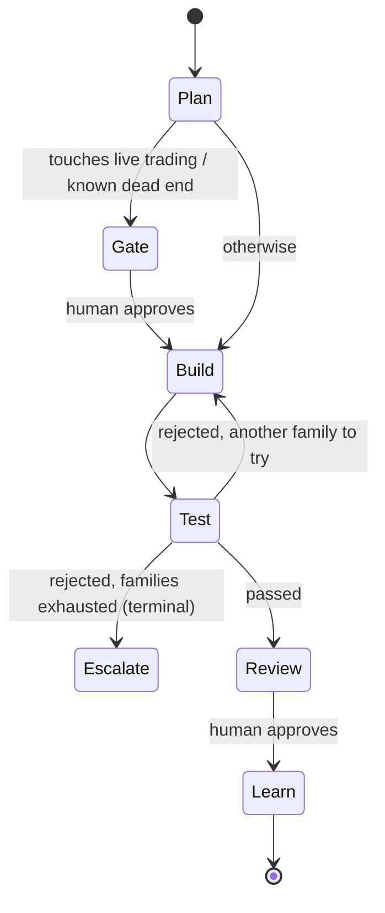

# Building an AI Quant Research Agent Team

**A tutorial: standing up a self-improving, multi-agent quant research desk on TeleRaft**

This guide builds a working research desk — four agents in a Telegram workspace that
propose hypotheses, backtest them, tear each other's work apart, and get better over
time. It follows the two headline features of
[HKUDS/Vibe-Trading](https://github.com/HKUDS/Vibe-Trading):

- **Self-Improving Trading Agent** — hypothesis → signal engine → backtest → metrics →
  refine, with a registry that tracks lineage and invalidation
- **Multi-Agent Trading Teams** — specialised roles (factor researcher, backtester, risk
  officer, macro analyst) working in parallel toward a reviewed conclusion

Everything here runs **offline with no API keys and no network**, on deterministic
synthetic data, so you can complete the whole tutorial before deciding whether to point
it at real market data.

---

## Contents

1. [Read this first: what this system will and will not do](#1-read-this-first-what-this-system-will-and-will-not-do)
2. [How Vibe-Trading's features map onto TeleRaft](#2-how-vibe-tradings-features-map-onto-teleraft)
3. [Five-minute quick start](#3-five-minute-quick-start)
4. [Meet the desk: the four roles](#4-meet-the-desk-the-four-roles)
5. [The research loop, step by step](#5-the-research-loop-step-by-step)
6. [The self-improving part: the hypothesis registry](#6-the-self-improving-part-the-hypothesis-registry)
7. [Running the desk from Telegram](#7-running-the-desk-from-telegram)
8. [Using real market data](#8-using-real-market-data)
9. [Using a real LLM for the research prose](#9-using-a-real-llm-for-the-research-prose)
10. [Tuning the research bar](#10-tuning-the-research-bar)
11. [Adding a new strategy family](#11-adding-a-new-strategy-family)
12. [Autonomous research with heartbeats](#12-autonomous-research-with-heartbeats)
13. [What this design does differently from Vibe-Trading](#13-what-this-design-does-differently-from-vibe-trading)
14. [Troubleshooting](#14-troubleshooting)

---

## 1. Read this first: what this system will and will not do

**This is research tooling, not a trading system.** The scope is a deliberate design
decision, not an omission:

| | |
|---|---|
| ✅ It does | Generate hypotheses, run backtests, compute metrics, verify out-of-sample, write research notes, record what was tested and what failed |
| ❌ It does not | Place orders, connect to a broker, size positions, manage money, or recommend a trade |

There is no order-placement code anywhere in `teleraft/quant/`, and no broker connector.
Vibe-Trading ships ten broker connectors with a mandate/kill-switch safety model; this
tutorial deliberately stops at the research boundary, because the interesting and
reusable part — a team that checks its own work — is upstream of execution.

Every agent's soul carries the rule **"You never place, size, or recommend an actual
trade"**, and every research note lands in **In Review** where a human must tap Approve.

> **Not investment advice.** Backtested results are not predictive of future returns.
> Synthetic data especially proves nothing about real markets — it exists so the
> machinery can be demonstrated and tested. Anything this desk produces is a starting
> point for your own analysis, and decisions about real money are yours alone. If you
> want advice, talk to a licensed adviser.

---

## 2. How Vibe-Trading's features map onto TeleRaft

| Vibe-Trading | TeleRaft equivalent | Where |
|---|---|---|
| Swarm presets (`quant_desk`, `risk_committee`, `macro_team`) | An agent team: YAML agents with souls, goals, and owned topics | [`agents/quant/`](../agents/quant/) |
| Swarm workers (factor researcher, backtester, risk manager) | Individual agents claiming tasks in shared channels | §4 |
| DAG scheduler blocking downstream on failure | The graph engine's Orchestrator: retry → replan → escalate, with checkpoints | [`graph/engine.py`](../teleraft/graph/engine.py) |
| Research Autopilot (hypothesis → signal → backtest → refine) | The Anthropic loop: Planner → Builder → Tester → Learn | §5 |
| Hypothesis Registry with invalidation | `HypothesisRegistry` — blocks re-testing dead ideas | [`quant/hypothesis.py`](../teleraft/quant/hypothesis.py) |
| Signal-engine code generation + AST sandbox | **Declarative `SignalSpec`** — validated data, never generated code | §13 |
| Backtest engine, metrics, run cards | `backtest()` + `BacktestResult` + `QuantRuntime.run_card()` | [`quant/backtest.py`](../teleraft/quant/backtest.py) |
| `get_market_data` tool + loader registry | `MarketDataLoader` protocol: synthetic, CSV, or your provider | §8 |
| Persistent memory across sessions | `MemoryService` + soul amendments | §6 |
| 16 IM channel adapters | Telegram is the native surface; Hermes/OpenClaw add the rest | [TELEGRAM_SETUP.md](TELEGRAM_SETUP.md) |
| Broker connectors, live trading, mandates | **Deliberately out of scope** | §1 |

---

## 3. Five-minute quick start

```bash
git clone https://github.com/rick-c-goog/agent-team.git
cd agent-team
python -m venv .venv && source .venv/bin/activate
pip install -e ".[dev]"
```

Run the desk:

```bash
python -m teleraft.quant_demo
```

You will see two scenarios. The second one matters more than the first.

**Scenario A — an edge survives.** Quinn searches momentum parameters in-sample on SPY,
finds `momentum(lookback=60)` with Sharpe 1.10, and Bailey re-runs it on data Quinn
never saw:

```
🧭 Plan by Quinn — acceptance criteria:
  1. Hypothesis registered and testable: momentum produces risk-adjusted edge on SPY
  2. Out-of-sample Sharpe ≥ 0.5
  3. Out-of-sample max drawdown ≤ 35%
🔧 Quinn: built step 1: Candidate: momentum(lookback=60) on SPY
✅ Bailey passed step 1
🟣 In Review — owner: Quinn 🤖 · tested by: Bailey 🤖 ✅
   In-sample: CAGR +19.8%, Sharpe 1.10, maxDD 19.1%
   [ ✅ Approve ]  [ ❌ Reject ]
```

**Scenario B — nothing survives.** On NVDA, every family is tried once and every one
fails out-of-sample:

```
🔧 Quinn: Candidate: momentum(lookback=60) on NVDA
❌ Bailey rejected: Out-of-sample Sharpe -1.09 < 0.5 (in-sample was 0.03)
🔧 Quinn: Candidate: sma_cross(fast=20, slow=100) on NVDA
❌ Bailey rejected: Out-of-sample Sharpe -0.14 < 0.5 (in-sample was 0.13)
🔧 Quinn: Candidate: mean_reversion(lookback=20, z_entry=1.5) on NVDA
❌ Bailey rejected: Out-of-sample Sharpe -0.37 < 0.5
🔧 Quinn: Candidate: vol_target(lookback=60, target_vol=0.1) on NVDA
❌ Bailey rejected: ...; All 4 strategy families tried on NVDA — no out-of-sample
   edge found; this is a negative result, not a failure
🚨 Escalation → a human is asked, nothing is shipped
```

Notice the in-sample vs out-of-sample columns: `momentum` looked *positive* in-sample
(+0.03) and was **-1.09** out-of-sample. That gap is what the desk exists to catch.

---

## 4. Meet the desk: the four roles

The team lives in [`agents/quant/`](../agents/quant/) — one YAML plus one soul per agent.
This is the `quant_desk` + `risk_committee` + `macro_team` preset shape, expressed as
TeleRaft agents.

| Agent | Seat | Owns | Escalates on |
|---|---|---|---|
| **Quinn** | Factor researcher — generates hypotheses, searches parameters | `# research` | live trading, real money, capital allocation |
| **Bailey** | Backtester/validator — the adversarial reviewer | `# backtest` | live trading, real money |
| **Robin** | Risk officer (admin role) — owns the limits | `# risk` | leverage, live trading |
| **Mac** | Macro analyst — regime context, single-regime warnings | `# macro` | live trading |

A representative agent:

```yaml
# agents/quant/quinn.yaml
name: Quinn
role: member
soul: souls/quinn.md
goals:
  owns: ["factor research", "# research"]
  escalate_when: ["live trading", "real money", "place order", "capital allocation"]
knowledge:
  - {type: file, uri: kb/quant/research-standards.md, scope: team}
heartbeat:
  - cron: "0 7 * * 1-5"
    prompt: "Review the hypothesis registry; propose one new testable hypothesis
             that does not restate an invalidated one."
runtime:
  engine: quant          # ← uses the backtest-driven runtime, not a prose model
```

Two things to notice:

- `escalate_when` is what makes "never trade without me" **structural**. Any task whose
  text mentions live trading pauses at a human gate before a single step runs.
- `engine: quant` selects `QuantRuntime`. A workspace can mix engines freely — prose
  agents on Claude, quant agents on the backtester, all in the same channels.

The shared knowledge base ([`kb/quant/`](../kb/quant/)) holds the desk's
[research standards](../kb/quant/research-standards.md) and
[risk limits](../kb/quant/risk-limits.md); agents retrieve and cite them (see
[TELEGRAM_SETUP.md §19](TELEGRAM_SETUP.md)).

---

## 5. The research loop, step by step

Each task runs the Anthropic loop, but with numbers instead of prose at every stage.



**Planner** ([`quant.py:plan`](../teleraft/runtime/quant.py)) registers a hypothesis and
sets *numeric* acceptance criteria — minimum out-of-sample Sharpe, maximum drawdown,
minimum bars. Criteria written before any building is what makes the later review
falsifiable rather than negotiable.

**Builder** searches a small parameter grid **on the in-sample window only** and emits a
declarative `SignalSpec` plus its metrics. The grid is deliberately small: a huge grid
mostly buys you overfitting, and the Builder reports how many parameter sets it searched
so the denominator is visible.

**Tester** — this is the important one. Bailey re-runs the winning spec on the
**held-out** window Quinn never saw:

```python
# teleraft/quant/data.py
def split_period(bars: Bars, oos_fraction: float = 0.3) -> tuple[Bars, Bars]:
    cut = int(len(bars) * (1.0 - oos_fraction))
    return (
        Bars(bars.symbol, bars.dates[:cut], bars.closes[:cut]),   # Builder sees this
        Bars(bars.symbol, bars.dates[cut:], bars.closes[cut:]),   # Tester sees this
    )
```

> **Why this is the crux.** TeleRaft's core rule is "no agent grades its own work". For
> prose, a second agent re-reading the draft is a real check. For a *strategy*, it is
> nearly worthless — a reviewer reading a backtest summary cannot see overfitting. A
> held-out period can. The out-of-sample split is the quant translation of that rule,
> and it is why the Tester is given data rather than an opinion.

When the Tester rejects, it does so with a number, not a judgement:

```
Out-of-sample Sharpe -1.09 < 0.5 (in-sample was 0.03)
```

and the Builder responds by trying a **different strategy family**, never by re-fitting
the same one harder. When every family is exhausted the verdict is marked `terminal`, so
the run escalates to a human immediately rather than burning its retry budget.

**Learn** writes the durable lesson back into the agent's memory
("`momentum(lookback=60)` did not survive out-of-sample on NVDA — in-sample parameter
search overfits this family"), where it is retrieved on future tasks.

---

## 6. The self-improving part: the hypothesis registry

A team with no memory of yesterday will re-propose the same dead idea every morning.
The registry ([`quant/hypothesis.py`](../teleraft/quant/hypothesis.py)) is what closes
the loop.

**Statuses:** `proposed → testing → supported | invalidated → retired`

Every backtest is attached to its hypothesis, in-sample and out-of-sample both:

```
🔬 Hypothesis registry
  ✅ hyp_491015d3 [supported] momentum produces risk-adjusted edge on SPY
      · IS  momentum(lookback=60)    Sharpe +1.10  maxDD 19.1%  CAGR +19.8%
      · OOS momentum(lookback=60)    Sharpe +2.00  maxDD 13.2%  CAGR +46.6%
  ❌ hyp_021e2e6a [invalidated] momentum produces risk-adjusted edge on NVDA
      ↳ Out-of-sample Sharpe -0.09 < 0.5 (in-sample was -0.00)
      · IS  momentum(lookback=60)    Sharpe +0.03  maxDD 24.9%  CAGR -0.8%
      · OOS momentum(lookback=60)    Sharpe -1.09  maxDD 29.0%  CAGR -15.1%
      ...
```

**The payoff:** proposing that dead idea again is refused, and the refusal carries the
reason:

```python
>>> registry.propose("Quinn", "momentum produces risk-adjusted edge on NVDA")
DuplicateHypothesis: already invalidated as hyp_021e2e6a:
    Out-of-sample Sharpe -0.09 < 0.5 (in-sample was -0.00)
```

Matching is by meaning, not string equality — a restatement ("risk-adjusted edge on NVDA
from momentum") is caught too, via token-set similarity above a 0.6 threshold.

**Two deliberate escape hatches**, because a registry that only ever says no would stop
research rather than improve it:

```python
# 1. A refinement — you read the earlier result and are responding to it.
registry.propose("Quinn", "momentum edge on NVDA with a volatility filter",
                 parent_id="hyp_021e2e6a")        # allowed: lineage declared

# 2. An explicit re-test — e.g. the original test itself was flawed.
registry.propose("Quinn", "momentum edge on NVDA", allow_retest=True)
```

`registry.lineage(hid)` then walks the chain back to the original idea, so any conclusion
can answer "what did we already try, and why did it fail?"

---

## 7. Running the desk from Telegram

Follow [TELEGRAM_SETUP.md](TELEGRAM_SETUP.md) to create your bots, supergroup, and
topics, then point the workspace at the quant agents:

```toml
# teleraft.toml
[app]
agents_dir = "agents/quant"
db_path = "teleraft_data/quant.db"

[telegram.topic_threads]
"# research" = "2"
"# backtest" = "3"
"# risk"     = "4"
"# macro"    = "5"
```

```bash
python -m teleraft.main
```

In the `# research` topic:

```
@Quinn is there a momentum edge on SPY?
```

The task card appears, Quinn claims it, the plan posts with its numeric criteria, the
candidate and the verdicts stream into the thread, and the research note lands **In
Review** with Approve/Reject buttons. Only Telegram user IDs in `human_ids` can approve.

**Commands:**

| Command | What it does |
|---|---|
| `@Quinn <question>` | Opens a research task; Quinn claims it |
| `/task <question>` | Opens an unclaimed task any agent can take |
| `/hyp list` | The research board — every hypothesis and its status |
| `/hyp list invalidated` | Only the dead ends, with reasons |
| `/hyp show <id>` | One hypothesis: all backtests, IS and OOS, plus lineage |
| `/kb add <uri>` | Add a document to the desk's knowledge base |

`/hyp` is read-only by design: hypotheses are created and killed by the research loop,
never by chat, so the registry stays an honest record of what was actually tested.

---

## 8. Using real market data

Synthetic data proves the machinery works; it says nothing about markets. To use real
prices, implement the loader protocol — it has exactly one method:

```python
class MarketDataLoader(Protocol):
    name: str
    def load(self, symbol: str, start: str, end: str) -> Bars: ...
```

### Option A — CSV you already have

```bash
mkdir -p data
# data/SPY.csv → date,open,high,low,close,volume
```

```python
from teleraft.quant.data import CsvLoader
loader = CsvLoader("data")
```

### Option B — a live provider (yfinance shown; CCXT, Tushare, Alpha Vantage are the same shape)

```python
# my_loaders.py
from teleraft.quant.data import Bars

class YFinanceLoader:
    name = "yfinance"

    def load(self, symbol: str, start: str = "", end: str = "") -> Bars:
        import yfinance as yf                       # pip install yfinance
        df = yf.download(symbol, start=start or "2015-01-01", end=end or None,
                         progress=False, auto_adjust=True)
        return Bars(
            symbol=symbol,
            dates=[d.strftime("%Y-%m-%d") for d in df.index],
            closes=[float(c) for c in df["Close"]],
        )
```

Wire it in when you build the app:

```python
from teleraft.app import App
from teleraft.runtime.quant import QuantRuntime
from my_loaders import YFinanceLoader

app = App(human_ids={"11111111"}, agents_dir="agents/quant")
quant = QuantRuntime(app.hypotheses, loader=YFinanceLoader())
app.engine.runtime_for = lambda agent: quant
```

**Use adjusted closes.** Splits and dividends in a raw close series will manufacture
returns that never existed — the single most common way a backtest lies to you.

---

## 9. Using a real LLM for the research prose

`QuantRuntime` is deterministic: it has no model calls, which is why the tests can
assert on exact Sharpe ratios. That is a feature for the numeric roles and a limitation
for the narrative ones.

The productive split is **Claude for prose, the backtester for verdicts**:

```python
from teleraft.runtime.anthropic_runtime import AnthropicRuntime
from teleraft.runtime.quant import QuantRuntime

claude = AnthropicRuntime(model="claude-fable-5")   # pip install -e ".[anthropic]"
quant = QuantRuntime(app.hypotheses)

def runtime_for(agent: str):
    # Bailey (validation) and Robin (risk) must stay numeric — their job is to be
    # unimpressed by a well-written argument.
    return quant if agent in ("Bailey", "Robin") else claude

app.engine.runtime_for = runtime_for
```

Keep the Tester numeric. A model asked "is this strategy good?" will find something
appreciative to say about almost anything; a held-out Sharpe ratio will not.

---

## 10. Tuning the research bar

The thresholds live in one place and are deliberately strict — **most ideas should die**:

```python
QuantRuntime(app.hypotheses, criteria={
    "min_sharpe": 0.8,        # default 0.5
    "max_drawdown": 0.25,     # default 0.35
    "min_bars": 400,          # default 200 — refuse to conclude from a short sample
    "beat_benchmark": True,   # default False — must also beat buy & hold
})
```

Also worth tuning:

```python
QuantRuntime(app.hypotheses,
             oos_fraction=0.4,     # bigger holdout = harder to fool, less to fit on
             commission=0.002)     # raise costs to kill high-turnover illusions
```

Keep [`kb/quant/risk-limits.md`](../kb/quant/risk-limits.md) in step with these numbers —
it is what the agents retrieve and cite when they explain a rejection.

A useful sanity check: if your desk's pass rate is high, your bar is too low. On the
demo's synthetic universe roughly **5 symbols in 15** yield a surviving edge, and that
feels about right for a research process that is working.

---

## 11. Adding a new strategy family

Two edits, both in reviewed code — never generated at runtime.

**1. Implement the signal** in [`quant/backtest.py`](../teleraft/quant/backtest.py):

```python
SPEC_TYPES = (..., "breakout")

# inside generate_weights()
if spec.type == "breakout":
    lookback = int(spec.params.get("lookback", 55))
    for i in range(n):
        if i < lookback:
            continue
        window = closes[i - lookback:i]
        weights[i] = 1.0 if closes[i] > max(window) else 0.0
    return weights
```

**2. Give the Builder a grid** in [`runtime/quant.py`](../teleraft/runtime/quant.py):

```python
PARAM_GRID["breakout"] = [{"lookback": 20}, {"lookback": 55}, {"lookback": 100}]
```

Add a test asserting the weights are bounded and the warm-up window is genuinely flat —
`tests/test_quant.py` has the pattern. The allow-list in `SPEC_TYPES` **is** the safety
boundary: an agent can only propose a spec that a human has already implemented and
reviewed.

---

## 12. Autonomous research with heartbeats

Quinn's heartbeat is already declared:

```yaml
heartbeat:
  - cron: "0 7 * * 1-5"
    prompt: "Review the hypothesis registry; propose one new testable hypothesis
             that does not restate an invalidated one."
```

Heartbeats fire from the Hermes Agent / OpenClaw host — see
[TELEGRAM_SETUP.md §18](TELEGRAM_SETUP.md). Each firing starts a normal graph run: same
loop, same out-of-sample gate, same human review. The desk researches overnight; you
arrive to a review queue and a registry that grew, and nothing shipped without you.

The registry is what makes autonomy safe to leave running. Without it, an agent waking
daily with no memory re-tests the same idea forever. With it, each morning's proposal
must be one that has not already been killed.

---

## 13. What this design does differently from Vibe-Trading

Both systems implement the same two features. Three choices here differ, and they are
worth understanding before you pick one:

**1. Declarative specs instead of generated code.** Vibe-Trading has its agent write
Python and then sandboxes it with AST inspection. Here an agent emits a validated
`SignalSpec` — data, not code — which ordinary reviewed code turns into positions:

```python
SignalSpec("sma_cross", {"fast": 20, "slow": 100})     # ✅ in the allow-list
SignalSpec("rm -rf /").validate()                       # ❌ SpecError
SignalSpec("momentum", {"lookback": "__import__('os')"}) # ❌ SpecError: must be numeric
```

You lose expressiveness — a genuinely novel signal needs a code change (§11). You gain
that no research task can execute arbitrary code as a side effect, and every strategy
ever proposed is diffable, replayable, and comparable.

**2. Out-of-sample verification is mandatory, not optional.** The Tester is a different
agent evaluating on data the Builder never saw, and this is enforced by the graph rather
than by prompting. It cannot be skipped by an agent that is confident.

**3. No execution path at all.** Vibe-Trading offers bounded live trading behind
mandates, kill switches, and audit ledgers — a serious safety model. This desk simply
has no broker code, so the failure mode does not exist. If you want execution, keep it
in a separate system with its own human controls; this one hands you a research note.

**Use Vibe-Trading if** you want breadth today: 18+ data providers, 452 pre-built
factors, 10 broker connectors, a web UI. **Use this if** you want a small auditable
research loop where every conclusion carries its evidence, its lineage, and a human
signature — and you would rather add data providers than remove execution paths.

---

## 14. Troubleshooting

| Symptom | Cause / fix |
|---|---|
| Every hypothesis is invalidated | Working as intended on synthetic data. Check `/hyp show <id>` — if in-sample is also poor, the symbol has no signal; if in-sample is strong and OOS is not, that is overfitting caught. |
| Everything passes | Your bar is too low. Raise `min_sharpe`, enable `beat_benchmark`, increase `oos_fraction` (§10). |
| `no eligible tester` | The desk needs ≥2 agents so nobody grades their own work. Keep at least Quinn and Bailey. |
| Wrong ticker picked up | Write tickers in caps: `NVDA`, not `nvda`. `_symbol_for` prefers uppercase tokens and defaults to `SPY`. |
| `SpecError: unknown signal type` | The family is not in `SPEC_TYPES`. Add it deliberately (§11) — this rejection is the safety boundary working. |
| Results change between runs | They should not: synthetic data is seeded per symbol. If you switched to a live loader, your provider is revising history (or you are using unadjusted closes — §8). |
| Run escalates with "families exhausted" | A negative result, not a bug. No family in the grid found an out-of-sample edge; add a family or change the universe. |
| A live-trading question stalls at a gate | Also working as intended: `escalate_when` fires before any step runs (§4). |
| Backtest looks too good | Check turnover and costs. Raise `commission`, and read the note's `📚 Sources` line — every number should trace to a backtest artifact. |

---

## Where to go next

- [DESIGN.md §5](../DESIGN.md) — the graph engine, checkpointing, and human gates
- [TELEGRAM_SETUP.md](TELEGRAM_SETUP.md) — bots, topics, onboarding agent, knowledge bases
- [`tests/test_quant.py`](../tests/test_quant.py) — the executable specification for
  everything above, including the no-lookahead and cost-accounting proofs
- [HKUDS/Vibe-Trading](https://github.com/HKUDS/Vibe-Trading) — the original, with far
  broader data and broker coverage

*Research output only. Not investment advice. This system places no orders.*
