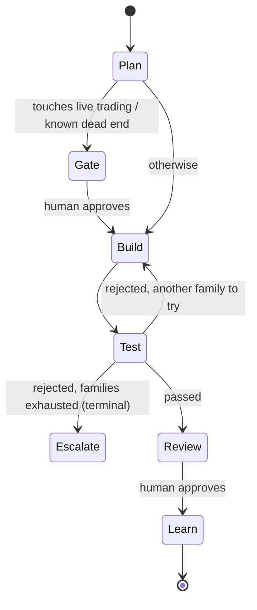

# Building an AI Quant Research Agent Team

**A tutorial: standing up a self-improving, multi-agent quant research desk on TeleRaft**

This guide builds a working research desk — four agents in a Telegram workspace that
propose hypotheses, backtest them, tear each other's work apart, and get better over
time. It follows three headline features of
[HKUDS/Vibe-Trading](https://github.com/HKUDS/Vibe-Trading):

- **Self-Improving Trading Agent** — hypothesis → signal engine → backtest → metrics →
  refine, with a registry that tracks lineage and invalidation
- **Multi-Agent Trading Teams** — specialised roles (factor researcher, backtester, risk
  officer, macro analyst) working in parallel toward a reviewed conclusion
- **Cross-Market Data & Backtesting** — A-shares, HK, US, crypto and FX, each with its own
  calendar, costs, settlement and currency, and portfolios that span them

Everything here runs **offline with no API keys and no network**, on deterministic
synthetic data, so you can complete the whole tutorial before deciding whether to point
it at real market data.

---

## Contents

1. [Read this first: what this system will and will not do](#1-read-this-first-what-this-system-will-and-will-not-do)
2. [How Vibe-Trading's features map onto TeleRaft](#2-how-vibe-tradings-features-map-onto-teleraft)
3. [Five-minute quick start](#3-five-minute-quick-start)
4. [Meet the desk: the four roles](#4-meet-the-desk-the-four-roles)
5. [The research loop, step by step](#5-the-research-loop-step-by-step)
6. [The self-improving part: the hypothesis registry](#6-the-self-improving-part-the-hypothesis-registry)
7. [The selection gate: correcting for how hard you searched](#7-the-selection-gate-correcting-for-how-hard-you-searched)
8. [The eleven-node factor graph](#8-the-eleven-node-factor-graph)
9. [Running the desk from Telegram](#9-running-the-desk-from-telegram)
10. [Cross-market data & backtesting](#10-cross-market-data--backtesting)
11. [Using real market data](#11-using-real-market-data)
12. [Using a real LLM for the research prose](#12-using-a-real-llm-for-the-research-prose)
13. [Tuning the research bar](#13-tuning-the-research-bar)
14. [Adding a new strategy family](#14-adding-a-new-strategy-family)
15. [Autonomous research with heartbeats](#15-autonomous-research-with-heartbeats)
16. [What this design does differently from Vibe-Trading](#16-what-this-design-does-differently-from-vibe-trading)
17. [Troubleshooting](#17-troubleshooting)

---

## 1. Read this first: what this system will and will not do

**This is research tooling, not a trading system.** The scope is a deliberate design
decision, not an omission:

| | |
|---|---|
| ✅ It does | Generate hypotheses, run backtests, compute metrics, verify out-of-sample, write research notes, record what was tested and what failed |
| ❌ It does not | Place orders, connect to a broker, size positions, manage money, or recommend a trade |

There is no order-placement code anywhere in `teleraft/quant/`, and no broker connector.
Vibe-Trading ships ten broker connectors with a mandate/kill-switch safety model; this
tutorial deliberately stops at the research boundary, because the interesting and
reusable part — a team that checks its own work — is upstream of execution.

Every agent's soul carries the rule **"You never place, size, or recommend an actual
trade"**, and every research note lands in **In Review** where a human must tap Approve.

> **Not investment advice.** Backtested results are not predictive of future returns.
> Synthetic data especially proves nothing about real markets — it exists so the
> machinery can be demonstrated and tested. Anything this desk produces is a starting
> point for your own analysis, and decisions about real money are yours alone. If you
> want advice, talk to a licensed adviser.

Every research note carries its own provenance line, so a number never travels without
the data behind it:

```
Data: synthetic (deterministic pseudo-prices — NOT real market data;
      results prove the machinery works, nothing about markets)
```

A desk on a real loader shows that loader's name instead (`Data: yfinance`). If you see
a Sharpe of 3.87 on a card, check that line first — on synthetic prices it means the
arithmetic is right, not that the strategy is.

---

## 2. How Vibe-Trading's features map onto TeleRaft

| Vibe-Trading | TeleRaft equivalent | Where |
|---|---|---|
| Swarm presets (`quant_desk`, `risk_committee`, `macro_team`) | An agent team: YAML agents with souls, goals, and owned topics | [`agents/quant/`](../agents/quant/) |
| Swarm workers (factor researcher, backtester, risk manager) | Individual agents claiming tasks in shared channels | §4 |
| DAG scheduler blocking downstream on failure | The graph engine's Orchestrator: retry → replan → escalate, with checkpoints | [`graph/engine.py`](../teleraft/graph/engine.py) |
| Research Autopilot (hypothesis → signal → backtest → refine) | The Anthropic loop: Planner → Builder → Tester → Learn | §5 |
| Hypothesis Registry with invalidation | `HypothesisRegistry` — blocks re-testing dead ideas | [`quant/hypothesis.py`](../teleraft/quant/hypothesis.py) |
| Signal-engine code generation + AST sandbox | **Declarative `SignalSpec`** — validated data, never generated code | §15 |
| Backtest engine, metrics, run cards | `backtest()` + `BacktestResult` + `QuantRuntime.run_card()` | [`quant/backtest.py`](../teleraft/quant/backtest.py) |
| Cross-market coverage (A-share/HK/US/crypto/FX) | `Market` registry: calendars, costs, settlement, currency per venue | [`quant/markets.py`](../teleraft/quant/markets.py), §9 |
| Composite backtests mixing markets, shared capital pool | `backtest_portfolio()` with per-symbol attribution and an FX guard | [`quant/portfolio.py`](../teleraft/quant/portfolio.py), §9.3 |
| `source: auto` per-market provider fallback chains | `LoaderRegistry` — ordered chains, failover, source health | §9.5 |
| `get_market_data` tool + loader registry | `MarketDataLoader` protocol: synthetic, CSV, or your provider | §10 |
| Persistent memory across sessions | `MemoryService` + soul amendments, consolidated weekly | §6 |
| Eleven-node factor graph (construction → validation → regime → portfolio → attribution) | The pipeline DAG: producers, gates, join, aggregate gate | [`quant/factor_pipeline.py`](../teleraft/quant/factor_pipeline.py), §8 |
| *(not in the source architectures)* | **Selection gate** — corrects significance for how many hypotheses were tested | §7 |
| Swarm run artifacts and traces | `/pipeline`, `/metrics`, and trace replay for attributing a change | §9, [DESIGN.md §5.9](../DESIGN.md) |
| 16 IM channel adapters | Telegram is the native surface; Hermes/OpenClaw add the rest | [TELEGRAM_SETUP.md](TELEGRAM_SETUP.md) |
| Broker connectors, live trading, mandates | **Deliberately out of scope** | §1 |

---

## 3. Five-minute quick start

```bash
git clone https://github.com/rick-c-goog/agent-team.git
cd agent-team
python -m venv .venv && source .venv/bin/activate
pip install -e ".[dev]"
```

Verify the install before trusting anything it prints — the whole quant stack is
covered, including the no-lookahead and cost-accounting proofs:

```bash
pytest tests/test_quant.py tests/test_cross_market.py tests/test_evaluation.py
```

Then run the desk:

```bash
python -m teleraft.quant_demo
```

You will see two scenarios. The second one matters more than the first.

**Scenario A — an edge survives.** Quinn searches momentum parameters in-sample on SPY,
finds `momentum(lookback=60)` with Sharpe 1.10, and Bailey re-runs it on data Quinn
never saw:

```
🧭 Plan by Quinn — acceptance criteria:
  1. Hypothesis registered and testable: momentum produces risk-adjusted edge on SPY
  2. Out-of-sample Sharpe ≥ 0.5
  3. Out-of-sample max drawdown ≤ 35%
🔧 Quinn: built step 1: Candidate: momentum(lookback=60) on SPY
✅ Bailey passed step 1
🟣 In Review — owner: Quinn 🤖 · tested by: Bailey 🤖 ✅
   In-sample: CAGR +19.8%, Sharpe 1.10, maxDD 19.1%
   [ ✅ Approve ]  [ ❌ Reject ]
```

**Scenario B — nothing survives.** On NVDA, every family is tried once and every one
fails out-of-sample:

```
🔧 Quinn: Candidate: momentum(lookback=60) on NVDA
❌ Bailey rejected: Out-of-sample Sharpe -1.09 < 0.5 (in-sample was 0.03)
🔧 Quinn: Candidate: sma_cross(fast=20, slow=100) on NVDA
❌ Bailey rejected: Out-of-sample Sharpe -0.14 < 0.5 (in-sample was 0.13)
🔧 Quinn: Candidate: mean_reversion(lookback=20, z_entry=1.5) on NVDA
❌ Bailey rejected: Out-of-sample Sharpe -0.37 < 0.5
🔧 Quinn: Candidate: vol_target(lookback=60, target_vol=0.1) on NVDA
❌ Bailey rejected: ...; All 4 strategy families tried on NVDA — no out-of-sample
   edge found; this is a negative result, not a failure
🚨 Escalation → a human is asked, nothing is shipped
```

Notice the in-sample vs out-of-sample columns: `momentum` looked *positive* in-sample
(+0.03) and was **-1.09** out-of-sample. That gap is what the desk exists to catch.

---

## 4. Meet the desk: the four roles

The team lives in [`agents/quant/`](../agents/quant/) — one YAML plus one soul per agent.
This is the `quant_desk` + `risk_committee` + `macro_team` preset shape, expressed as
TeleRaft agents.

| Agent | `role` | Seat | Owns | Escalates on |
|---|---|---|---|---|
| **Quinn** | `member` | Factor researcher — generates hypotheses, searches parameters | `# research` | live trading, real money, capital allocation |
| **Bailey** | **`qa`** | Backtester/validator — the desk's dedicated reviewer | `# research`, `# backtest` | live trading, real money |
| **Robin** | `admin` | Risk officer — owns the limits | `# risk` | leverage, live trading |
| **Mac** | `member` | Macro analyst — regime context, single-regime warnings | `# macro` | live trading |

**Bailey's `role: qa` is what routes review to it.** When Quinn builds something, the
platform picks the Tester in this order: a `qa` agent whose `owns` overlaps the builder's
→ any `qa` agent → any other agent. Never the builder. Review is a distinct skill, so a
reviewer whose whole job is to disbelieve accumulates failure patterns instead of
construction habits — which is why the desk has a dedicated seat rather than rotating the
duty. A two-agent desk still gets adversarial review through the final fallback.

A representative agent:

```yaml
# agents/quant/quinn.yaml
name: Quinn
role: member
soul: souls/quinn.md
goals:
  owns: ["factor research", "# research"]
  escalate_when: ["live trading", "real money", "place order", "capital allocation"]
knowledge:
  - {type: file, uri: kb/quant/research-standards.md, scope: team}
heartbeat:
  - cron: "0 7 * * 1-5"
    prompt: "Review the hypothesis registry; propose one new testable hypothesis
             that does not restate an invalidated one."
runtime:
  engine: quant          # ← uses the backtest-driven runtime, not a prose model
```

Two things to notice:

- `escalate_when` is what makes "never trade without me" **structural**. Any task whose
  text mentions live trading pauses at a human gate before a single step runs.
- `engine: quant` selects `QuantRuntime`. A workspace can mix engines freely — prose
  agents on Claude, quant agents on the backtester, all in the same channels.

The shared knowledge base ([`kb/quant/`](../kb/quant/)) holds the desk's
[research standards](../kb/quant/research-standards.md) and
[risk limits](../kb/quant/risk-limits.md); agents retrieve and cite them (see
[TELEGRAM_SETUP.md §19](TELEGRAM_SETUP.md)).

---

## 5. The research loop, step by step

Each task runs the Anthropic loop, but with numbers instead of prose at every stage.



**Planner** ([`quant.py:plan`](../teleraft/runtime/quant.py)) registers a hypothesis and
sets *numeric* acceptance criteria — minimum out-of-sample Sharpe, maximum drawdown,
minimum bars. Criteria written before any building is what makes the later review
falsifiable rather than negotiable.

**Builder** searches a small parameter grid **on the in-sample window only** and emits a
declarative `SignalSpec` plus its metrics. The grid is deliberately small: a huge grid
mostly buys you overfitting, and the Builder reports how many parameter sets it searched
so the denominator is visible.

**Tester** — this is the important one. Bailey re-runs the winning spec on the
**held-out** window Quinn never saw:

```python
# teleraft/quant/data.py
def split_period(bars: Bars, oos_fraction: float = 0.3) -> tuple[Bars, Bars]:
    cut = int(len(bars) * (1.0 - oos_fraction))
    return (
        Bars(bars.symbol, bars.dates[:cut], bars.closes[:cut]),   # Builder sees this
        Bars(bars.symbol, bars.dates[cut:], bars.closes[cut:]),   # Tester sees this
    )
```

> **Why this is the crux.** TeleRaft's core rule is "no agent grades its own work". For
> prose, a second agent re-reading the draft is a real check. For a *strategy*, it is
> nearly worthless — a reviewer reading a backtest summary cannot see overfitting. A
> held-out period can. The out-of-sample split is the quant translation of that rule,
> and it is why the Tester is given data rather than an opinion.

When the Tester rejects, it does so with a number, not a judgement:

```
Out-of-sample Sharpe -1.09 < 0.5 (in-sample was 0.03)
```

and the Builder responds by trying a **different strategy family**, never by re-fitting
the same one harder. When every family is exhausted the verdict is marked `terminal`, so
the run escalates to a human immediately rather than burning its retry budget.

**Learn** writes the durable lesson back into the agent's memory
("`momentum(lookback=60)` did not survive out-of-sample on NVDA — in-sample parameter
search overfits this family"), where it is retrieved on future tasks.

---

## 6. The self-improving part: the hypothesis registry

A team with no memory of yesterday will re-propose the same dead idea every morning.
The registry ([`quant/hypothesis.py`](../teleraft/quant/hypothesis.py)) is what closes
the loop.

**Statuses:** `proposed → testing → supported | invalidated → retired`

Every backtest is attached to its hypothesis, in-sample and out-of-sample both:

```
🔬 Hypothesis registry
  ✅ hyp_491015d3 [supported] momentum produces risk-adjusted edge on SPY
      · IS  momentum(lookback=60)    Sharpe +1.10  maxDD 19.1%  CAGR +19.8%
      · OOS momentum(lookback=60)    Sharpe +2.00  maxDD 13.2%  CAGR +46.6%
  ❌ hyp_021e2e6a [invalidated] momentum produces risk-adjusted edge on NVDA
      ↳ Out-of-sample Sharpe -0.09 < 0.5 (in-sample was -0.00)
      · IS  momentum(lookback=60)    Sharpe +0.03  maxDD 24.9%  CAGR -0.8%
      · OOS momentum(lookback=60)    Sharpe -1.09  maxDD 29.0%  CAGR -15.1%
      ...
```

**The payoff:** proposing that dead idea again is refused, and the refusal carries the
reason:

```python
>>> registry.propose("Quinn", "momentum produces risk-adjusted edge on NVDA")
DuplicateHypothesis: already invalidated as hyp_021e2e6a:
    Out-of-sample Sharpe -0.09 < 0.5 (in-sample was -0.00)
```

Matching is by meaning, not string equality — a restatement ("risk-adjusted edge on NVDA
from momentum") is caught too, via token-set similarity above a 0.6 threshold.

**Two deliberate escape hatches**, because a registry that only ever says no would stop
research rather than improve it:

```python
# 1. A refinement — you read the earlier result and are responding to it.
registry.propose("Quinn", "momentum edge on NVDA with a volatility filter",
                 parent_id="hyp_021e2e6a")        # allowed: lineage declared

# 2. An explicit re-test — e.g. the original test itself was flawed.
registry.propose("Quinn", "momentum edge on NVDA", allow_retest=True)
```

`registry.lineage(hid)` then walks the chain back to the original idea, so any conclusion
can answer "what did we already try, and why did it fail?"

---

## 7. The selection gate: correcting for how hard you searched

This is the gate most desks skip, and the one that decides whether a research pipeline
produces knowledge or expensive noise.

### 7.1 The problem an agent desk makes worse

At a 5% significance threshold, **1 in 20 pure-noise hypotheses passes by construction**.
That is not a bug in the test — it is what "5% significance" means. A human testing three
ideas a week absorbs this quietly. An agent desk testing three hundred does not: 10,000
trials manufacture roughly 500 "significant" discoveries from data with no structure at
all.

Out-of-sample testing does not save you here, and neither do better statistics. Newey–West
standard errors and bootstrap resampling correct **one** test for autocorrelation and
non-normality; they say nothing about the fact that you ran the test ten thousand times.

The intuition: with `n` independent tries, the best t-statistic you should *expect* from
luck alone grows like `√(2 ln n)`.

```python
from teleraft.pipeline.selection import expected_max_of_n, deflate

expected_max_of_n(10)      # 1.57  — the bar luck clears after 10 tries
expected_max_of_n(1000)    # 3.26
expected_max_of_n(10000)   # 3.86

deflate(2.0, 1)            # +2.00 — a Sharpe of 2 found on the first try
deflate(2.0, 100)          # -0.53 — the same number after 100 tries is *below* luck
```

A Sharpe of 2.0 is impressive once. Found on the hundredth attempt, it is what searching
produces from noise — and the deflated statistic says so.

### 7.2 Why this platform can do it and a stateless swarm cannot

The correction needs one input a stateless system does not have: **how many things you
tested**. The hypothesis registry (§6) has recorded every trial since the desk started, so
the count is already there.

> **The trial count is part of the evidence.** A Sharpe ratio reported without the number
> of hypotheses tested to find it is not a finding. This is the design rule that makes the
> registry more than an audit log.

### 7.3 Reading the report

Both corrections are reported, because they answer different questions and quoting one
invites the reader to assume the other:

```python
from teleraft.pipeline.selection import assess

report = assess(app.storage, "quant-desk", alpha=0.05, window_days=90)
print(report.summary())
# 214 trials in the last 90d; ~10.7 false positives expected at α=0.05;
# 1 survive FDR; best 6.00 → deflated 3.21
```

| Field | Question it answers |
|---|---|
| `expected_false_positives` | How many "discoveries" this much searching produces from nothing |
| `survivors_fdr` | Of the things called significant, which survive false-discovery-rate control |
| `best_statistic` → `deflated_statistic` | How impressive the best result is *given* the number of shots taken |

A deflated statistic at or below zero earns an explicit note: *the best result does not
clear what N trials of pure search would produce — treat it as a null result.*

### 7.4 The window rolls

Counting every hypothesis since inception makes the correction monotonically more
punishing until the desk can never conclude anything. The ledger therefore uses a
**rolling window** (90 days by default), which keeps the correction honest about *current*
search intensity rather than accumulated history:

```python
assess(storage, "quant-desk", window_days=90)    # what you searched recently
assess(storage, "quant-desk", epoch="v2")        # exclude a superseded universe/cost model
```

Trials from a superseded epoch — you changed the universe, or the cost model — are
excluded by label rather than silently, because the exclusion is itself a research
decision someone should be able to see.

### 7.5 The test that matters

`tests/test_evaluation.py` asserts the property directly: feed 200 pure-noise trials with
uniformly distributed p-values, and the desk must produce the ~10 naive "discoveries" that
α=0.05 guarantees and **zero** after correction. That distinction is the whole difference
between a research pipeline and a random number generator with good manners.

---

## 8. The eleven-node factor graph

Sections 5–7 research **one hypothesis at a time**. A factor desk works differently: it
builds several factors in parallel, gates each independently, combines what survives into
one portfolio, and asks whether the result is new. That is a DAG, not a loop, and the
platform's pipeline engine expresses it directly.

```bash
python -m teleraft.factor_demo
```

### 8.1 The eleven nodes, and which kind each is

| Node(s) | Kind | Job |
|---|---|---|
| **1–7** | `producer` | Construct MKT, SMB, HML, MOM, RMW, CMA, LVOL — in parallel, no gate |
| **8** | `gate` | **Validator** — Newey–West t, bootstrap, in-sample→out-of-sample degradation |
| **9** | `gate` | **Regime auditor** — kills anything that works in one regime only |
| **10** | `join` | **Portfolio constructor** — risk parity over the *survivors*, neutralised |
| **11** | `aggregate_gate` | **Risk decomposer** — residual alpha against an *independent* benchmark |

The node *kinds* are what make the schedule correct: nodes 8 and 9 run **per factor** so
MOM can be at node 9 while LVOL is still at node 8; node 10 is a **barrier**, because
risk-parity weights depend on the covariance of the surviving set and starting early
gives a different portfolio rather than an earlier one; node 11 judges the **whole**, so
seven passing factors still do not settle it.

Nodes 1–7 are **one parameterised producer**, not seven near-identical ones — each factor
still gets its own item, its own gate records, and its own artifact, so the per-factor
audit trail survives the consolidation.

> **Node 1 emits two things.** The MKT factor, which a gate may kill, *and* a per-stock
> beta estimate that node 10 needs for beta-neutralisation regardless. Killing a factor
> must not delete the artifacts it produced.

### 8.2 Four of the seven cannot be built from prices

This is the part a tutorial is tempted to skip, and it is the part that decides whether
the desk is honest:

| Node | Factor | Needs | Buildable here? |
|---|---|---|---|
| 1 | MKT | prices | ✅ rolling regression |
| 2 | SMB | **shares outstanding** (for market cap) | ⛔ blocked |
| 3 | HML | **point-in-time book equity** | ⛔ blocked |
| 4 | MOM | prices | ✅ 12-minus-1-month |
| 5 | RMW | **point-in-time revenue, COGS, assets** | ⛔ blocked |
| 6 | CMA | **point-in-time total assets** | ⛔ blocked |
| 7 | LVOL | prices | ✅ trailing realized vol |

Those four report `cannot_evaluate` and **block**. They are not approximated with a
proxy, because fundamentals *as currently reported* embed restatements the market never
had — look-ahead that no downstream gate can detect, since the resulting backtest stays
internally consistent and is simply wrong.

```
⛔ HML   blocked  node 3 (Value — high-minus-low book-to-market) needs point-in-time
                 fundamentals — configure a source that supplies it
```

Supply the data and they unblock. The message distinguishes *missing data* from *missing
builder*, so nobody spends an afternoon hunting for a feed they already have.

### 8.3 Node 8 kills with a number

```
❌ MOM   killed   Newey–West t 0.15 below 2.0 (naive t was 0.15);
                  bootstrap p 0.896 above 0.05;
                  in-sample→out-of-sample degradation 100% above 30%
```

The naive t-statistic is reported alongside the adjusted one so the correction is visible
rather than asserted. On autocorrelated data the HAC figure is materially smaller — that
gap *is* the reason the gate exists.

These are **ordinary functions in `teleraft/quant/stats.py`, not model calls.** A
t-statistic computed by an LLM is strictly worse than one computed by arithmetic. Each is
tested against a known answer: HAC discounts autocorrelation, the bootstrap separates
signal from noise, OLS recovers planted coefficients.

### 8.4 Node 9 uses volatility terciles, and says so

A hidden Markov model is the literature's answer. This uses **terciles of trailing
realized volatility** — crude, transparent, and with no fitting step of its own to
overfit. Anything concluded from it should say "volatility tercile", not "regime" as if a
latent state had been identified. Swapping in an HMM later changes one function.

### 8.5 Node 11 is where the concept is easiest to get wrong

Node 10 builds the portfolio as a weighted combination of the surviving factors. If node
11 then regresses that portfolio on **those same factors**, the regressors span it by
construction:

```python
ols(y, [y]).alpha        # 0.0 exactly
ols(y, [y]).r_squared    # 1.0 exactly
```

R² → 1 and residual alpha → 0 *as arithmetic*, returning the same answer for a brilliant
portfolio and a worthless one. So the gate **refuses** that regression:

```
⛔ benchmark shares ['MKT', 'MOM'] with the constructed factors — the regressors would
   span the portfolio and residual alpha would be zero by construction, not by finding
```

Attribution needs **independently constructed** benchmarks — published Fama–French,
Carhart momentum, betting-against-beta — not your own reconstructions. With none
configured, node 11 blocks rather than reporting a meaningless zero.

Universe mismatch between your data and a published benchmark is **accepted and
reported**, not treated as fatal: an exact-universe benchmark is often unobtainable, a
stated mismatch is honest, and refusing to attribute at all is worse than attributing
with a caveat.

### 8.6 Be accurate about what this graph is

MKT, SMB, HML, MOM, RMW, CMA and LVOL *are* the Fama–French five plus momentum plus
betting-against-beta — the canonical **published** factors. A portfolio of known factors
has, by definition, close to zero alpha relative to those factors.

So this is a **factor replication, portfolio construction and risk attribution system**,
and a genuinely useful one: it tells you whether your implementation of value matches the
literature's, how the premia behaved across volatility regimes, and what a neutralised
risk-parity combination looks like. Calling it *alpha discovery* misdescribes it. Real
discovery is what happens when node 11's input is a signal **not** in the benchmark set —
which the graph supports by adding an eighth producer while the benchmark stays external.

### 8.7 Nothing surviving is a result

```
1/7 survived; 2 killed; 4 blocked
```

Nodes 8 and 9 applied honestly to real factors will sometimes kill all of them — value
has endured decade-long droughts, momentum crashes in identifiable regimes. Node 10 then
reports what killed each rather than producing a portfolio, and a desk that cannot return
"nothing survived" will eventually be tuned until it never has to.

Every validated factor also lands in the **trial ledger**, so §7's selection gate can
correct for how many were tested. Seven factors is a mild correction; a desk screening
hundreds is not.

### 8.8 Tuning the gates

```python
from teleraft.quant.factor_pipeline import FactorGateConfig, build_factor_pipeline

config = FactorGateConfig(
    min_tstat=2.0,            # Newey–West adjusted
    max_p_value=0.05,         # bootstrap
    max_degradation=0.30,     # in-sample → out-of-sample
    min_regimes_working=2,    # must work in more than one volatility tercile
    bootstrap_iterations=10_000,
    validator="Bailey",       # never the maker (§4)
)
pipeline = build_factor_pipeline(universe, benchmark=published, config=config)
```

`/pipeline` in Telegram shows the last runs and what each gate killed.

---

## 9. Running the desk from Telegram

Follow [TELEGRAM_SETUP.md](TELEGRAM_SETUP.md) to create your bots, supergroup, and
topics, then point the workspace at the quant agents:

```toml
# teleraft.toml
[app]
agents_dir = "agents/quant"
db_path = "teleraft_data/quant.db"

[telegram.topic_threads]
"# research" = "2"
"# backtest" = "3"
"# risk"     = "4"
"# macro"    = "5"
```

```bash
python -m teleraft.main
```

Check the startup log names the quant desk — this is the single most common live
misconfiguration:

```
INFO agents loaded (4): Bailey, Mac, Quinn, Robin
```

If it lists `Cole, Penn, Ray` instead, `agents_dir` is still the default and `@Quinn`
will not resolve. `/agents` in the group shows the same thing.

In the `# research` topic:

```
@Quinn is there a momentum edge on SPY?
```

The task card appears, Quinn claims it, the plan posts with its numeric criteria, the
candidate and the verdicts stream into the thread, and the research note lands **In
Review** with Approve/Reject buttons. Only Telegram user IDs in `human_ids` can approve.

**Commands:**

| Command | What it does |
|---|---|
| `@Quinn <question>` | Opens a research task; Quinn claims it |
| `/task <question>` | Opens an unclaimed task any agent can take |
| `/hyp list` | The research board — every hypothesis and its status |
| `/hyp list invalidated` | Only the dead ends, with reasons |
| `/hyp show <id>` | One hypothesis: all backtests, IS and OOS, plus lineage |
| `/kb add <uri>` | Add a document to the desk's knowledge base |
| `/kb list` | Every source, its sync status, and any staleness |
| `/board` · `/board all` | The kanban as text — this topic, or the whole desk |
| `/agents` | Who is on the desk, what each owns, what escalates |
| `/pipeline` | Recent pipeline runs and what each gate killed |
| `/metrics` | Cost, failures by node, and the human intervention rate |

`/hyp` is read-only by design: hypotheses are created and killed by the research loop,
never by chat, so the registry stays an honest record of what was actually tested.

---

## 10. Cross-market data & backtesting

A desk that only researches US equities is not a desk. This section covers Vibe-Trading's
third feature — coverage across A-shares, HK, US, crypto and FX — and it is worth
understanding *why* it is a correctness feature rather than a breadth feature.

### 9.1 The bug that motivates it

Sharpe ratios are annualised: `Sharpe = mean_return × periods / (σ × √periods)`. Equities
trade ~252 days a year; crypto trades 365. Annualise a crypto strategy with 252 and every
number is wrong by a factor of `√(365/252)` ≈ **1.20**:

To see the effect on its own you have to **hold costs constant**, because venues differ
in fees too — crypto's 25 bp round trip against US equities' 10 bp would otherwise swamp
the comparison and tell you nothing about annualisation:

```python
bars = SyntheticLoader().load("BTC-USD")
spec = SignalSpec("momentum", {"lookback": 60})

crypto    = backtest(bars, spec, market="CRYPTO", commission=0.0, slippage=0.0)
as_equity = backtest(bars, spec, market="US",     commission=0.0, slippage=0.0)

crypto.sharpe / as_equity.sharpe     # 1.2026  ==  sqrt(365/252) = 1.2035
```

Sharpe scales with `√periods`, so the ratio is exactly `√(365/252)` — a **20%
misstatement** produced silently by a constant. `tests/test_cross_market.py` asserts that
ratio, so the bug cannot come back.

> Drop the `commission=0.0, slippage=0.0` and the numbers move for a *second* reason:
> crypto costs more to trade. That is correct behaviour and a bad demonstration — when
> you want to isolate one convention, hold the others fixed.

That is a ~20% misstatement produced silently, by a constant. The same class of error
applies to costs (HK stamp duty is ~2× US commission), to shorting (A-share retail
shorting is effectively unavailable), and to currency (adding HKD P&L to USD P&L gives a
number that means nothing).

So the conventions are **data**, in [`quant/markets.py`](../teleraft/quant/markets.py),
and every result carries the ones that produced it.

### 9.2 The market registry

| Market | Ticker convention | Currency | Periods/yr | Round-trip cost | Shorting |
|---|---|---|---|---|---|
| `US` | `AAPL`, `SPY.US` | USD | 252 | 10 bp | yes |
| `HK` | `0700.HK` | HKD | 246 | 19 bp | yes |
| `CN` | `600519.SS`, `000001.SZ` | CNY | 243 | 18 bp | **no** |
| `CRYPTO` | `BTC-USD`, `ETHUSDT` | USD | 365 | 25 bp | yes |
| `FX` | `EURUSD=X` | USD | 260 | 3 bp | yes |

The market is inferred from the ticker, or passed explicitly:

```python
from teleraft.quant import backtest, market_for, SignalSpec

market_for("600519.SS").code        # 'CN'   — T+1, no shorting, CNY
market_for("BTC-USD").periods_per_year   # 365

backtest(bars, spec)                     # conventions inferred from bars.symbol
backtest(bars, spec, market="HK")        # explicit override
```

Results carry their provenance, so a number never travels without its assumptions:

```
sma_cross(fast=20, slow=100) on 600519.SS (CN) [2020-01-01→2025-09-30]:
    CAGR +2.3%, Sharpe 0.23, maxDD 28.9%, turnover 21.0x, vs buy&hold +26.5%
```

> **On T+1.** China A-shares settle T+1, and `min_holding_bars=1` records that. At
> **daily** bars it is already satisfied by the one-bar signal lag — a position taken at
> bar *i* is exited at *i+1* at the earliest, which *is* T+1 — so the setting is a no-op
> on daily data and binds only on intraday bars. The A-share constraints that actually
> bite at daily frequency are the **short ban** and the **higher costs**, both applied
> automatically. Saying this precisely matters: a guide that claims T+1 is "handled"
> without saying when it binds is teaching you to trust the wrong thing.

### 9.3 Portfolio backtests across venues

Single-symbol research is a toy; the unit a desk decides on is a portfolio. Capital is
shared across sleeves and each symbol's signal scales its own:

```python
from teleraft.quant import SyntheticLoader, SignalSpec, backtest_portfolio

loader = SyntheticLoader()
universe = {s: loader.load(s) for s in ["SPY", "QQQ", "BTC-USD"]}
p = backtest_portfolio(universe, SignalSpec("momentum", {"lookback": 60}))

print(p.summary())
# portfolio[3 symbols across CRYPTO+US] [2020-01-01→2025-09-30]:
#   CAGR +24.7%, Sharpe 2.33, maxDD 6.8%, vs equal-weight buy&hold +129.9% (USD)

for line in p.attribution_lines():
    print(line)
# SPY (US): contributed +78.5%, exposure 68%
# BTC-USD (CRYPTO): contributed +22.6%, exposure 42%
# QQQ (US): contributed +18.9%, exposure 48%
```

Three cross-market problems it handles explicitly:

- **Different calendars.** Returns are joined on the **union** of dates. A symbol whose
  venue was closed contributes nothing that day rather than having its history shifted
  forward — which would fabricate alignment that never existed.
- **Blended annualisation.** `p.periods_per_year` is the exposure-weighted average of the
  constituent venues (282.08 above, between 252 and 365), not a constant.
- **Attribution that reconciles.** Per-symbol `contribution` figures are arithmetic, so
  they sum **exactly** to `p.arithmetic_return`. They do not sum to `p.total_return`,
  which compounds — both figures exist so the difference is explicit rather than a
  rounding mystery.

### 9.4 Currencies: refused, not guessed

Adding HKD P&L to USD P&L silently is the kind of error that produces a confident,
meaningless backtest. So it raises:

```python
>>> backtest_portfolio({"SPY": spy, "0700.HK": tencent}, spec)
CurrencyMismatch: portfolio spans ['HKD', 'USD'] with no fx_rates supplied —
    converting is your decision, not the backtester's. Pass base_currency= and
    fx_rates={'HKD': 0.128, ...}, or restrict the universe to one currency.
```

Supply the conversion and it proceeds:

```python
p = backtest_portfolio(
    {"SPY": spy, "0700.HK": tencent, "600519.SS": moutai},
    SignalSpec("momentum", {"lookback": 60}),
    base_currency="USD",
    fx_rates={"USD": 1.0, "HKD": 0.128, "CNY": 0.138},
)
```

A constant rate is a simplification — real cross-currency P&L needs an FX *series*. The
constant is honest about being a constant, which is the point.

### 9.5 Provider fallback chains (`source: auto`)

Vibe-Trading routes each market through a chain of providers. `LoaderRegistry` is the
same idea: try loaders in order, fail over on error, and **never** return an empty series
silently.

```python
from teleraft.quant import LoaderRegistry, CsvLoader, SyntheticLoader

registry = LoaderRegistry(
    chains={
        "US":     [YFinanceLoader(), CsvLoader("data")],
        "CRYPTO": [CcxtLoader(), CsvLoader("data")],
        "CN":     [TushareLoader(), CsvLoader("data")],
    },
    default=[CsvLoader("data")],
)

bars = registry.load("BTC-USD")      # tries ccxt, falls back to CSV
registry.health()                     # [{'symbol': ..., 'loader': 'ccxt', 'error': ...}]
```

If every loader in a chain fails, it raises `LookupError` listing each failure. A backtest
on an empty series is worse than no backtest, so that outcome is impossible by
construction. (Pass `default=[]` to mean "no fallback" — an explicitly empty chain is
honoured rather than being replaced with synthetic data.)

### 9.6 Asking the desk a cross-market question

Mention several tickers and the loop researches them as a portfolio:

```
@Quinn is there a momentum edge across SPY, QQQ and BTC-USD?
```

The Planner adds cross-market acceptance criteria automatically:

```
🧭 Plan by Quinn — acceptance criteria:
  1. Hypothesis registered and testable: momentum produces risk-adjusted edge on
     the SPY, QQQ, BTC-USD portfolio
  2. Out-of-sample Sharpe ≥ 0.5
  ...
  6. Each venue's own conventions are applied (CRYPTO+US: annualisation, costs,
     settlement, shorting)
  risks: venues keep different calendars — alignment is by date, not by row
```

and the review card carries the venue mix and per-symbol attribution. If the universe
spans currencies without FX rates configured, the Builder reports it as blocked work for
a human rather than inventing a rate.

The `run_card` records exactly which conventions produced the numbers:

```python
card["venues"]                                        # ['CRYPTO', 'US']
card["market_conventions"]["BTC-USD"]["periods_per_year"]   # 365
card["market_conventions"]["SPY"]["periods_per_year"]       # 252
```

### 9.7 What is deliberately not here

Vibe-Trading covers futures and options with contract specifications, margin, and roll
logic; it also handles India's T+1 delivery and 18+ providers. This implementation covers
**spot instruments only** — equities, crypto, and FX as price series. Futures and options
need contract multipliers, expiry, roll conventions, and margin modelling, and a backtest
that treats an option like a stock is not approximately right, it is wrong. Adding them
means adding an instrument model, not a market row.

---

## 11. Using real market data

Synthetic data proves the machinery works; it says nothing about markets. To use real
prices, implement the loader protocol — it has exactly one method:

```python
class MarketDataLoader(Protocol):
    name: str
    def load(self, symbol: str, start: str, end: str) -> Bars: ...
```

### Option A — CSV you already have

```bash
mkdir -p data
# data/SPY.csv → date,open,high,low,close,volume
```

```python
from teleraft.quant.data import CsvLoader
loader = CsvLoader("data")
```

### Option B — a live provider (yfinance shown; CCXT, Tushare, Alpha Vantage are the same shape)

```python
# my_loaders.py
from teleraft.quant.data import Bars

class YFinanceLoader:
    name = "yfinance"

    def load(self, symbol: str, start: str = "", end: str = "") -> Bars:
        import yfinance as yf                       # pip install yfinance
        df = yf.download(symbol, start=start or "2015-01-01", end=end or None,
                         progress=False, auto_adjust=True)
        return Bars(
            symbol=symbol,
            dates=[d.strftime("%Y-%m-%d") for d in df.index],
            closes=[float(c) for c in df["Close"]],
        )
```

Wire it in when you build the app:

```python
from teleraft.app import App
from teleraft.runtime.quant import QuantRuntime
from my_loaders import YFinanceLoader

app = App(human_ids={"11111111"}, agents_dir="agents/quant")
quant = QuantRuntime(app.hypotheses, loader=YFinanceLoader())
app.engine.runtime_for = lambda agent: quant
```

**Use adjusted closes.** Splits and dividends in a raw close series will manufacture
returns that never existed — the single most common way a backtest lies to you.

---

## 12. Using a real LLM for the research prose

`QuantRuntime` is deterministic: it has no model calls, which is why the tests can
assert on exact Sharpe ratios. That is a feature for the numeric roles and a limitation
for the narrative ones.

> **The quant desk needs no API key.** Every agent in [`agents/quant/`](../agents/quant/)
> declares `engine: quant`, and each agent's own declaration wins over the global
> `runtime_engine` in `teleraft.toml`. So you can run the whole desk — hypotheses,
> backtests, out-of-sample verification — with no credentials at all. The startup log
> confirms the routing:
>
> ```
> INFO agent Quinn → quant runtime
> INFO agent Bailey → quant runtime
> ```
>
> If a line says `→ claude runtime`, that agent declares no engine (or declares Claude)
> and will need `ANTHROPIC_API_KEY`. Startup checks the key only for agents that
> actually need one, and fails fast naming them.

The productive split is **Claude for prose, the backtester for verdicts**, set per agent
in YAML:

```yaml
# agents/quant/quinn.yaml — narrative role, wants a model
runtime:
  engine: claude
```
```yaml
# agents/quant/bailey.yaml — verdict role, must stay numeric
runtime:
  engine: quant
```

or in code:

```python
from teleraft.runtime.anthropic_runtime import AnthropicRuntime
from teleraft.runtime.quant import QuantRuntime

claude = AnthropicRuntime(model="claude-fable-5")   # pip install -e ".[anthropic]"
quant = QuantRuntime(app.hypotheses)

def runtime_for(agent: str):
    # Bailey (validation) and Robin (risk) must stay numeric — their job is to be
    # unimpressed by a well-written argument.
    return quant if agent in ("Bailey", "Robin") else claude

app.engine.runtime_for = runtime_for
```

Keep the Tester numeric. A model asked "is this strategy good?" will find something
appreciative to say about almost anything; a held-out Sharpe ratio will not.

---

## 13. Tuning the research bar

The thresholds live in one place and are deliberately strict — **most ideas should die**:

```python
QuantRuntime(app.hypotheses, criteria={
    "min_sharpe": 0.8,        # default 0.5
    "max_drawdown": 0.25,     # default 0.35
    "min_bars": 400,          # default 200 — refuse to conclude from a short sample
    "beat_benchmark": True,   # default False — must also beat buy & hold
})
```

Also worth tuning:

```python
QuantRuntime(app.hypotheses,
             oos_fraction=0.4,     # bigger holdout = harder to fool, less to fit on
             commission=0.002)     # raise costs to kill high-turnover illusions
```

Keep [`kb/quant/risk-limits.md`](../kb/quant/risk-limits.md) in step with these numbers —
it is what the agents retrieve and cite when they explain a rejection.

A useful sanity check: if your desk's pass rate is high, your bar is too low. On the
demo's synthetic universe roughly **5 symbols in 15** yield a surviving edge, and that
feels about right for a research process that is working.

---

## 14. Adding a new strategy family

Two edits, both in reviewed code — never generated at runtime.

**1. Implement the signal** in [`quant/backtest.py`](../teleraft/quant/backtest.py):

```python
SPEC_TYPES = (..., "breakout")

# inside generate_weights()
if spec.type == "breakout":
    lookback = int(spec.params.get("lookback", 55))
    for i in range(n):
        if i < lookback:
            continue
        window = closes[i - lookback:i]
        weights[i] = 1.0 if closes[i] > max(window) else 0.0
    return weights
```

**2. Give the Builder a grid** in [`runtime/quant.py`](../teleraft/runtime/quant.py):

```python
PARAM_GRID["breakout"] = [{"lookback": 20}, {"lookback": 55}, {"lookback": 100}]
```

Add a test asserting the weights are bounded and the warm-up window is genuinely flat —
`tests/test_quant.py` has the pattern. The allow-list in `SPEC_TYPES` **is** the safety
boundary: an agent can only propose a spec that a human has already implemented and
reviewed.

---

## 15. Autonomous research with heartbeats

Quinn's heartbeat is already declared:

```yaml
heartbeat:
  - cron: "0 7 * * 1-5"
    prompt: "Review the hypothesis registry; propose one new testable hypothesis
             that does not restate an invalidated one."
```

Heartbeats fire from the Hermes Agent / OpenClaw host — see
[TELEGRAM_SETUP.md §18](TELEGRAM_SETUP.md). Each firing starts a normal graph run: same
loop, same out-of-sample gate, same human review. The desk researches overnight; you
arrive to a review queue and a registry that grew, and nothing shipped without you.

The registry is what makes autonomy safe to leave running. Without it, an agent waking
daily with no memory re-tests the same idea forever. With it, each morning's proposal
must be one that has not already been killed.

---

## 16. What this design does differently from Vibe-Trading

Both systems implement the same two features. Three choices here differ, and they are
worth understanding before you pick one:

**1. Declarative specs instead of generated code.** Vibe-Trading has its agent write
Python and then sandboxes it with AST inspection. Here an agent emits a validated
`SignalSpec` — data, not code — which ordinary reviewed code turns into positions:

```python
SignalSpec("sma_cross", {"fast": 20, "slow": 100})     # ✅ in the allow-list
SignalSpec("rm -rf /").validate()                       # ❌ SpecError
SignalSpec("momentum", {"lookback": "__import__('os')"}) # ❌ SpecError: must be numeric
```

You lose expressiveness — a genuinely novel signal needs a code change (§12). You gain
that no research task can execute arbitrary code as a side effect, and every strategy
ever proposed is diffable, replayable, and comparable.

**2. Out-of-sample verification is mandatory, not optional.** The Tester is a different
agent evaluating on data the Builder never saw, and this is enforced by the graph rather
than by prompting. It cannot be skipped by an agent that is confident.

**3. No execution path at all.** Vibe-Trading offers bounded live trading behind
mandates, kill switches, and audit ledgers — a serious safety model. This desk simply
has no broker code, so the failure mode does not exist. If you want execution, keep it
in a separate system with its own human controls; this one hands you a research note.

**Use Vibe-Trading if** you want breadth today: 18+ data providers, 452 pre-built
factors, 10 broker connectors, a web UI. **Use this if** you want a small auditable
research loop where every conclusion carries its evidence, its lineage, and a human
signature — and you would rather add data providers than remove execution paths.

---

## 17. Troubleshooting

| Symptom | Cause / fix |
|---|---|
| Every hypothesis is invalidated | Working as intended on synthetic data. Check `/hyp show <id>` — if in-sample is also poor, the symbol has no signal; if in-sample is strong and OOS is not, that is overfitting caught. |
| Everything passes | Your bar is too low. Raise `min_sharpe`, enable `beat_benchmark`, increase `oos_fraction` (§11). |
| `no eligible tester` | The desk needs ≥2 agents so nobody grades their own work. Keep at least Quinn and Bailey. |
| Wrong ticker picked up | Write tickers in caps: `NVDA`, not `nvda`. `_symbol_for` prefers uppercase tokens and defaults to `SPY`. |
| `SpecError: unknown signal type` | The family is not in `SPEC_TYPES`. Add it deliberately (§12) — this rejection is the safety boundary working. |
| Results change between runs | They should not: synthetic data is seeded per symbol. If you switched to a live loader, your provider is revising history (or you are using unadjusted closes — §9). |
| Run escalates with "families exhausted" | A negative result, not a bug. No family in the grid found an out-of-sample edge; add a family or change the universe. |
| A live-trading question stalls at a gate | Also working as intended: `escalate_when` fires before any step runs (§4). |
| Backtest looks too good | Check turnover and costs. Raise `commission`, and read the note's `📚 Sources` line — every number should trace to a backtest artifact. |
| `401 invalid x-api-key` during a run | An agent is routed to Claude. The quant desk needs no key — check the startup log for `agent X → claude runtime`, then either set `ANTHROPIC_API_KEY` in **the same environment that runs TeleRaft**, or give that agent `engine: quant` (§11). |
| `❌ Run failed at the <node> step` in the thread | A node raised. The message carries the cause, and the task returns to *Todo* so you can re-run it once the cause is fixed. |
| `CurrencyMismatch: portfolio spans [...]` | Working as intended (§9.4). Supply `base_currency` + `fx_rates`, or keep the universe to one currency. |
| Crypto Sharpe looks different than before | It is now annualised with 365 rather than 252 (§9.1). The old number was wrong by ~20%. |
| A-share strategy never shorts | Correct: `CN.allows_short = False`, enforced in `backtest()`. Retail A-share shorting is effectively unavailable. |
| `LookupError: no loader could supply <symbol>` | Every provider in that market's chain failed; the error lists each failure. An empty series is never returned silently (§9.5). |
| Attribution does not sum to the headline return | It sums to `arithmetic_return`, not the compounded `total_return` (§9.3). Both are reported. |
| Passing `commission=0` still shows costs | Slippage is a separate market convention. Pass `slippage=0.0` too for a cost-free run. |
| Futures/options symbols behave like stocks | Out of scope (§9.7) — they need contract multipliers, expiry and margin. Do not use spot backtests for them. |

---

## Where to go next

- [DESIGN.md §5](../DESIGN.md) — the graph engine, checkpointing, and human gates
- [TELEGRAM_SETUP.md](TELEGRAM_SETUP.md) — bots, topics, onboarding agent, knowledge bases
- [`tests/test_quant.py`](../tests/test_quant.py) — the executable specification for
  everything above, including the no-lookahead and cost-accounting proofs
- [HKUDS/Vibe-Trading](https://github.com/HKUDS/Vibe-Trading) — the original, with far
  broader data and broker coverage

*Research output only. Not investment advice. This system places no orders.*
